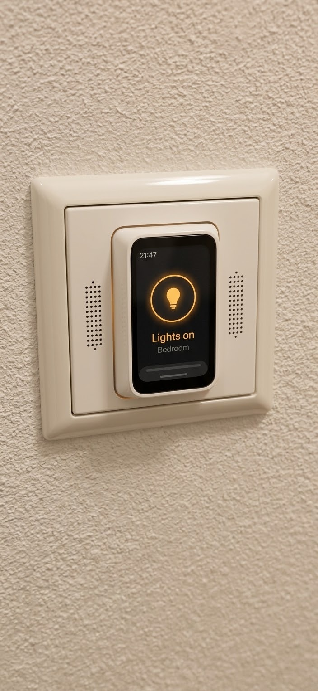
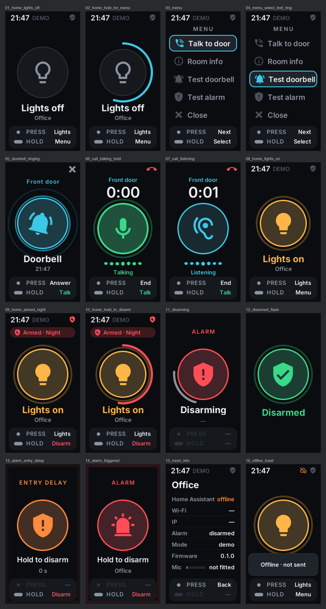

# RoomKey

**A key for every room: a small touch screen on a mechanical keyboard switch, set into an
ordinary German light-switch frame. Doorbell, intercom, alarm and lights, one press away.
Built on ESP32-C6, ESPHome and Home Assistant.**

[Deutsch](README.de.md)

> Status: prototype. The firmware runs on a bare dev board on the desk, the microphone is
> verified, the rest of the parts are ordered. Nothing is installed in a wall yet.
> State of this page: 29 September 2026.

<p align="center">
  
  <br><em>Target design — an AI-generated concept render (Google Gemini), not a photo of a built device.</em>
</p>

## What it is

- **A light switch first.** The white rocker around the key still switches the room light,
  with no software involved, so it works without Wi-Fi, without Home Assistant and even
  with a crashed ESP32.
- **A key with a screen.** A 1.47″ touch display on top of a mechanical keyboard switch.
  **Press** does the obvious thing, **hold** does the deliberate thing, and the screen always
  says which is which. Tap and swipe for the rest.
- **The doorbell in every bedroom.** It rings, shows who is calling, and you answer with the
  key: hold to talk, release to listen.
- **The alarm, where you are.** Armed at night? Hold the key for 1.5 s to disarm — Home
  Assistant decides whether that room is allowed to.
- **Local and standard.** ESPHome native API: Home Assistant discovers it with ordinary
  entities, events and actions. No cloud, no custom integration.

It is the in-house counterpart of [Klingelbox](https://github.com/martinkadauke/intercom), the
open-hardware door intercom.

## Status

| Area | State |
|---|---|
| UI + interaction state machine (lights, alarm, doorbell, call, menu, info) | ✅ done — runs on the board, verified in simulator and on hardware (scripted tour) |
| Home Assistant contract (subscriptions, light.toggle, disarm script, events, actions) | ✅ **11/11 against a real Home Assistant** (2026.9 dev instance, `tools/ha_contract_test.py`): lights toggle, disarm via HA policy (NIGHT allowed, AWAY refused), ring → answer / talk / hang-up events; also 11/11 against the fake HA incl. audio (`tools/fake_home.py --test`) |
| Demo mode (everything works standalone, no HA needed) | ✅ on by default |
| Status LED (WS2812 on the PoC board; glow ring on the touch board) | ✅ implemented — colours per state, not visually checked |
| Microphone (INMP441) | ✅ **verified on hardware** — wired, recorded: 1 kHz test beep +30 dB, speech +18 dB over the room; 120 Hz high-pass removes knock/handling rumble. Test: `esphome/mic_test.yaml` + `tools/mic_check.py` |
| Intercom audio (RTP/L16 16 kHz, push-to-talk) | 🟡 **WIP** — works simulator ⇄ fake door; hardware untested (needs Wi-Fi) |
| Speaker + ringtone (MAX98357A + Waveshare 2030 cavity speaker 8 Ω 2 W) | 🟡 **WIP / opt-in** — compiles, commented out; parts ordered |
| Touch variant of the board (tap / swipe) | 🟡 **WIP** — required by the target design; 1× ordered; board package ready, touch logic tested in the simulator only |
| Intercom security | ✅ incoming audio accepted only during an active call; everything else is dropped unheard |
| Door station side | ⬜ other milestone — spec in [docs/intercom-protocol.md](docs/intercom-protocol.md) |
| Optional sensors: VEML7700 light, SHT31-D climate, LD2410C mmWave presence | 🟡 bought; light + climate on the shared I²C bus (no extra pins), radar on one pin — radar placement behind the rocker still open |
| Enclosure / wall insert | 🟡 fit model + tolerance coupon ready ([hardware/](hardware/)); desk rig (v0) → wall-size fit (v1) next |



## Inputs

| Screen | Tap | Swipe ↑ | Swipe ↓ | Key press | Key hold |
|---|---|---|---|---|---|
| Home | wakes, shows a hint — never an action | menu | — | all lights | menu · **disarm** when armed |
| Ringing | answer | — | silence this room | answer (on key-down) | answer + talk |
| Call | hold the disc = talk | — | hang up | hang up | push-to-talk |
| Menu | select | — | close | next | select |
| Alarm | — | — | — | hint | **disarm** (1.5 s) |
| **White rocker** | switches this room's light, no software | | | | |

* A tap never switches anything on the home screen: the rocker surrounds the key, so fingers
  brush the screen all the time.
* A mechanical press always starts as a touch; key-down cancels that touch, so one press never
  fires twice.
* The key works on a dark screen — slap it in the dark to switch the lights.

## Hardware

The desk prototype runs on a **Waveshare ESP32-C6-LCD-1.47** (no touch). The target is the
**ESP32-C6-Touch-LCD-1.47** — same chip, touch layer, different size and pinout; the firmware
switches with one line.

### Board comparison (Waveshare drawings)

| | ESP32-C6-LCD-1.47 (PoC, non-touch) | ESP32-C6-Touch-LCD-1.47 |
|---|---|---|
| Outline | 36.4 × 20.3 mm bare PCB | 44.5 × 24.6 mm in black frame, 10.6 mm thick |
| Header | 2 × 9, one GND | 2 × 11, two GND, VBUS, VBAT |
| Mic SCK/WS/SD, L/R | IO18/IO19/IO23, L/R→IO0 | IO7/IO8/IO17, L/R→GND or IO3 |
| Amp BCLK/LRC/DIN, power | IO18/IO19/IO20, 5V | IO7/IO8/IO16, VBUS |
| Key | BOOT + GND | BOOT + GND |

Firmware: swap the `board:` line in `roomkey.yaml`. The keycap is **not** interchangeable.

### Wiring (desk prototype: ESP32-C6-LCD-1.47)

| Part | Pins |
|---|---|
| Mechanical key switch | **BOOT** + **GND** (parallel to the BOOT button — no extra GPIO; the onboard BOOT button *is* the key today) |
| INMP441 mic | VDD→**3V3**, GND→**GND**, L/R→**IO0** (held low by firmware — the header has only one GND), SCK→**IO18**, WS→**IO19**, SD→**IO23** |
| I²S amp (WIP, e.g. MAX98357A) | VIN→**5V**, GND, BCLK→**IO18**, LRC→**IO19**, DIN→**IO20** |

INMP441 is bottom-port: the hole in its PCB must face the room. Mic and amp share the I²S
clocks → half-duplex by design (= push-to-talk, no echo).

Speaker: Waveshare 2030 cavity speaker (8 Ω, 2 W, 20 × 30 × 5.5 mm). Standing on its edge it fits
behind a side wing of the 55 × 55 mm rocker — see the [fit check](docs/fit-check-speaker.png).

## Quick start

```bash
cd esphome
esphome run roomkey.yaml            # build + flash over USB (first time) or OTA
```
1. **Wi-Fi** (nothing is hardcoded): open https://web.esphome.io in Chrome → *Connect* →
   pick the board → enter Wi-Fi. Or join the hotspot `RoomKey Office` (password: `ap_password`
   in `esphome/secrets.yaml`).
2. **Home Assistant** discovers it; add it with the `api_key` from `esphome/secrets.yaml`,
   then enable *Allow the device to perform Home Assistant actions*.
3. Copy [homeassistant/roomkey_package.yaml](homeassistant/roomkey_package.yaml) into your HA packages.
4. Turn off the key's **Demo mode** switch once the entities exist.

One file per room: copy `roomkey.yaml`, change `node_name`, `room_name` and the entity ids.

## Home Assistant contract

| Direction | What |
|---|---|
| key subscribes | `light.all_lights`, `alarm_control_panel.house`, `binary_sensor.doorbell_button` |
| key calls | `light.toggle`, `script.roomkey_disarm {room, entity_id}` (policy lives in HA) |
| key fires | event `esphome.roomkey {room, node, type}` · type ∈ answer, dismiss, call_door, hangup, talk_start, talk_stop |
| key offers | `ring`, `ring_stop`, `call_state(state)`, `show_toast(message)`, `set_intercom_peer(peer_host, peer_port)`, `simulate_alarm/lights/key` |
| entities | Demo mode, Screen brightness, Input (event: press/hold/…), Screen, Test doorbell, Wi-Fi, IP, intercom counters |

**Security note:** a disarm button in every room is also a disarm button for an intruder.
The key never stores a code — it *asks* HA, and the shipped script only allows disarming
HOME/NIGHT modes and a running entry delay/alarm, never AWAY. Decide that policy consciously.

## Develop without hardware

```bash
cd esphome
esphome compile sim.yaml                                   # desktop simulator (SDL)
.esphome/build/roomkey-sim/.pioenvs/roomkey-sim/program     # SPACE = key, mouse = touch
RK_TOUR=1 RK_TOUR_EXIT=1 RK_SHOTS=shots .esphome/build/roomkey-sim/.pioenvs/roomkey-sim/program  # screenshot every state
~/.local/share/uv/tools/esphome/bin/python ../tools/fake_home.py --host localhost --test   # HA + door contract test
~/.local/share/uv/tools/esphome/bin/python ../tools/fake_home.py --host roomkey-office.local  # interactive fake HA
```
`tour_device.yaml` runs the same tour on the real board and logs frame timings.

## Repository

| Path | What |
|---|---|
| [`esphome/roomkey.yaml`](esphome/roomkey.yaml) | device entry, one per room |
| [`esphome/packages/`](esphome/packages/) | board contracts (PoC, touch, simulator) and feature packages: core UI, HA contract, mic, intercom, speaker |
| [`esphome/src/roomkey_ui.h`](esphome/src/roomkey_ui.h) | UI, input grammar and state machine (LVGL 9) |
| [`esphome/src/roomkey_audio.h`](esphome/src/roomkey_audio.h) | RTP/L16 audio link |
| [`homeassistant/`](homeassistant/) | HA package: disarm policy, ring-stop, door hooks |
| [`tools/fake_home.py`](tools/fake_home.py) | fake Home Assistant + door station: contract test and interactive console |
| [`tools/ha_contract_test.py`](tools/ha_contract_test.py) | the same contract against a real Home Assistant (with [`homeassistant/dev/roomkey.yaml`](homeassistant/dev/roomkey.yaml) stand-ins) |
| [`tools/mic_check.py`](tools/mic_check.py) | records the microphone and checks it hears a test sound |
| [`tools/privacy_scan.py`](tools/privacy_scan.py) | runs before every push |
| [`docs/north-star.md`](docs/north-star.md) | the target design and its decisions |
| [`docs/intercom-protocol.md`](docs/intercom-protocol.md) | audio format and call sequence |
| [`docs/handoff-doorbell-thread.md`](docs/handoff-doorbell-thread.md) | the interface agreed with Klingelbox |

## Performance notes (ESP32-C6, no PSRAM)

RAM 36 % used. Measured on hardware: steady-state LVGL frames 30–80 ms, full view
switches ≈ 100 ms. Software shadows, transform-scaled press animations and a full-screen
alarm tint were replaced by outline halos, size animation and edge bars after the
first hardware run showed 140 ms frames.

## Next steps

1. Enclosure: parametric FreeCAD generator, desk test rig (v0), then a wall-size fit (v1).
2. Speaker, amp and touch board on the bench as they arrive.
3. Wi-Fi + Home Assistant on the real device.
4. Intercom with Klingelbox: a minimal SIP client is the likely path (see the handoff doc).
5. The wall: neutral wire, deep box, impulse relay — with an electrician.

## Privacy

- The microphone only runs while you hold the key during a call, or while the *Room info*
  screen shows its live level meter. Nothing is recorded or sent otherwise.
- Incoming audio is only accepted during an active call. Keep RoomKeys in the IoT VLAN, like the
  door devices.

## Safety

- Anything on 230 V — the power supply in the wall box, the relay for the room light — is a job
  for an electrician. The desk prototype runs on USB only.
- Many older German light-switch boxes have no neutral wire; check before planning a mains supply.

## Licences

- Code (firmware, scripts): [MIT](LICENSE), except the AXS5106L touch driver in
  `esphome/components/axs5106l/`, which keeps its own [MIT licence](LICENSES/MIT-axs5106l-Olivier-Latignies.txt)
- Icon font (Material Design Icons): [Pictogrammers Free License](LICENSES/MDI-Pictogrammers-Free-License.txt)
- Hardware designs (CAD scripts, STL, STEP): [CERN-OHL-P-2.0](LICENSES/CERN-OHL-P-2.0.txt)
- Documentation and images: [CC BY 4.0](LICENSES/CC-BY-4.0.txt)

Designed and written with [Claude Code](https://claude.com/claude-code).
