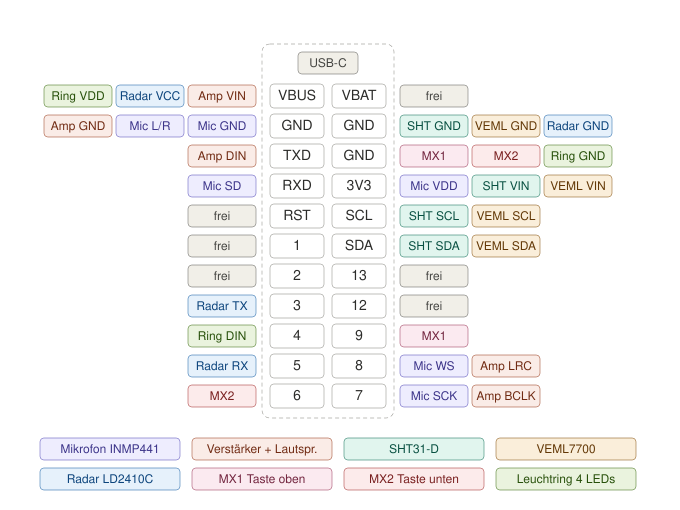

# RoomKey Touch — wiring (prototype)

Every wire from the board to each part of the RoomKey Touch prototype: microphone, amplifier and speaker, sensors, keys and
glow ring. It is checked against the firmware (`esphome/roomkey_touch.yaml` and its packages, `main` 2026-10-05).

Scope: **prototype on the bench and the desk replica** ("table A" in the insert's file, `features/roomkey-einsatz.md` §4).
The wall insert v1 differs: IO3 and IO5 go to the plate and the relay there, and the radar has no place yet.

**SELV only:** 5 V from USB-C. Nothing here ever touches 230 V.



*Back of the board, USB-C at the top. Next to each pad are the part pins that go there. Colours: mic purple, amp coral, SHT31-D teal, VEML7700 amber, radar blue, MX1 pink, MX2 red, glow ring green; grey = leave free. The ground wires are spread over the three GND pads by part group.*

## The board: Waveshare ESP32-C6-Touch-LCD-1.47

Header H1: 2 × 11 bare pads, 2.54 mm pitch. The silkscreen names the pads by GPIO number. The view is from the **back**
(components side), USB-C at the top. **From the front (display side) the two columns are mirrored.**

```
                 USB-C
     left column          right column
   VBUS  ● H1-1      H1-2  ●  VBAT   (not used: no battery in aikos)
   GND   ● H1-3      H1-4  ●  GND
   TXD   ● H1-5      H1-6  ●  GND
   RXD   ● H1-7      H1-8  ●  3V3
   RST   ● H1-9      H1-10 ●  SCL
   1     ● H1-11     H1-12 ●  SDA
   2     ● H1-13     H1-14 ●  13     (USB D+, don't use)
   3     ● H1-15     H1-16 ●  12     (USB D−, don't use)
   4     ● H1-17     H1-18 ●  9      (BOOT)
   5     ● H1-19     H1-20 ●  8
   6     ● H1-21     H1-22 ●  7
```

| Pad (silkscreen) | H1 | GPIO | Used for |
|---|---|---|---|
| VBUS | 1 | — | **5 V** (from USB-C): amplifier, radar, LEDs |
| GND | 3, 4, 6 | — | ground for every part |
| TXD | 5 | GPIO16 | I²S data **out** → amplifier DIN |
| RXD | 7 | GPIO17 | I²S data **in** ← microphone SD |
| 3V3 | 8 | — | **3.3 V** (on-board regulator, 800 mA): microphone, SHT31-D, VEML7700 |
| SCL | 10 | GPIO19 | I²C clock: SHT31-D, VEML7700 (shared with the board's touch and IMU) |
| SDA | 12 | GPIO18 | I²C data: SHT31-D, VEML7700 (shared with the board's touch and IMU) |
| 3 | 15 | GPIO3 | radar TX → ESP (UART RX) |
| 4 | 17 | GPIO4 | glow ring data → first LED's DIN |
| 5 | 19 | GPIO5 | ESP (UART TX) → radar RX |
| 6 | 21 | GPIO6 | key bottom (MX 2) |
| 7 | 22 | GPIO7 | I²S bit clock (BCLK/SCK): microphone **and** amplifier |
| 8 | 20 | GPIO8 | I²S word select (WS/LRC): microphone **and** amplifier |
| 9 | 18 | GPIO9 | key top (MX 1); also the board's BOOT button |
| RST, 1, 2, 12, 13, VBAT | 9, 11, 13, 16, 14, 2 | — | **don't connect**: reset, display bus, USB, battery |

## Every wire, by part

### Microphone INMP441 (I²S)
| INMP441 | → board pad | Note |
|---|---|---|
| VDD | 3V3 | **3.3 V only** |
| GND | GND | |
| L/R | GND | left channel (the firmware reads the left slot) |
| SCK | 7 | shared with the amplifier's BCLK |
| WS | 8 | shared with the amplifier's LRC |
| SD | RXD | |

### Amplifier MAX98357A (I²S) and speaker
| MAX98357A | → board pad | Note |
|---|---|---|
| VIN | VBUS | 5 V |
| GND | GND | |
| BCLK | 7 | shared with the microphone's SCK |
| LRC | 8 | shared with the microphone's WS |
| DIN | TXD | |
| GAIN | — | leave open (9 dB) |
| SD | — | leave open |
| OUT + / OUT − | speaker + / − | 8 Ω, never to ground |

Microphone and amplifier share one I²S bus, so the key works half-duplex: the speaker stops while you hold the key.

### Temperature and humidity SHT31-D (I²C, address 0x44)
| SHT31-D | → board pad | Note |
|---|---|---|
| VIN | 3V3 | |
| GND | GND | |
| SCL | SCL | |
| SDA | SDA | |
| ADR | — | open = 0x44 |
| ALR | — | open |

Place it in room air, away from the ESP and the amplifier, which heat up.

### Light VEML7700 (I²C, address 0x10) — optional
| VEML7700 | → board pad | Note |
|---|---|---|
| VIN | 3V3 | |
| GND | GND | |
| SCL | SCL | |
| SDA | SDA | |
| 3Vo | — | don't use |

It needs a window to the room.

### Presence radar HLK-LD2410C (UART 256000 baud)
| LD2410C | → board pad | Note |
|---|---|---|
| VCC | VBUS | **5 V** |
| GND | GND | |
| TX | 3 | radar sends, ESP receives |
| RX | 5 | ESP sends, radar receives |
| OUT | — | not used (the firmware reads the UART) |

It looks through plastic, but not through metal.

### Keys: two MX switches (the rocker, read separately)
| Switch | Leg 1 → pad | Leg 2 → pad | In HA |
|---|---|---|---|
| top (KEY1) | 9 | GND | "Key top" |
| bottom (KEY2) | 6 | GND | "Key bottom" |

Don't wire them in parallel. Holding the top key while power comes on starts the board in download mode: release it and
power-cycle.

### Glow ring: 4 × WS2812B-MINI 3535 (one chain)
| From | → to | Note |
|---|---|---|
| pad 4 | LED 1 DIN | data, 3.3 V level |
| LED 1 DOUT | LED 2 DIN | the chain continues: LED 2 → 3 → 4 |
| VBUS | VDD of every LED | 5 V |
| GND | GND of every LED | |

The chain order is bottom right → top right → top left → bottom left. The firmware drives 4 × WS2812 with GRB colour
order on GPIO4.

3.3 V data into LEDs that run on 5 V is at the edge of their spec, though it usually works on a short wire. If the first
LED flickers, add a level shifter (74AHCT1G125), or feed that LED's VDD through a diode (about 4.3 V).

## Shared lines at a glance

| Line | Pad | Goes to |
|---|---|---|
| 5 V | VBUS | amplifier VIN, radar VCC, LED VDD |
| 3.3 V | 3V3 | microphone VDD, SHT31-D VIN, VEML7700 VIN |
| GND | GND (3 pads) | every part, the microphone's L/R, both keys |
| I²C | SCL, SDA | SHT31-D (0x44), VEML7700 (0x10); on the board: touch 0x63, IMU 0x6B |
| I²S clock | 7 | microphone SCK, amplifier BCLK |
| I²S word select | 8 | microphone WS, amplifier LRC |

**One wire per board pad.** Where several parts share a line, don't put several wires on the board's pad. Run one wire to
the first part and **chain** on from part to part: solder the next wire to the same pin of that breakout, which has
bigger pads and no display next to it.

| Line | Chain | Wire |
|---|---|---|
| 5 V | VBUS → amp VIN → radar VCC → LED 1 VDD → LED 2 … | AWG 26–28 (the amp draws a few hundred mA) |
| 3.3 V | 3V3 → mic VDD → SHT31-D VIN → VEML7700 VIN | AWG 30 |
| GND 1 | GND (H1-3) → mic GND → amp GND | AWG 28 |
| GND 2 | GND (H1-4) → SHT31-D GND → VEML7700 GND → radar GND | AWG 30 |
| GND 3 | GND (H1-6) → MX1 leg 2 → MX2 leg 2 → LED 1 GND → LED 2 … | AWG 30 |
| I²C clock | SCL → SHT31-D SCL → VEML7700 SCL | AWG 30 |
| I²C data | SDA → SHT31-D SDA → VEML7700 SDA | AWG 30 |
| I²S clock | 7 → mic SCK → amp BCLK | AWG 30, short |
| I²S word select | 8 → mic WS → amp LRC | AWG 30, short |

The mic's L/R goes to GND **on the mic board itself**: a short bridge from its L/R pin to its GND pin, so no extra wire runs
to the board.

On the bench with jumper wires, a small breadboard does the same job: one wire from each pad into its row, and the parts plug
into that row. For a tidy prototype, a small piece of stripboard with one strip per line works as a hub: the insert's hub
board does this later.

## Power without USB

VBUS is wired to the USB-C connector's VBUS. 5 V fed into the VBUS pad powers the board exactly as USB does, plus everything
on the 5 V chain.

**Bench: a lab power supply**
- Set it with the output off: **5.0 V** (5.2 V at most; the amp and LEDs allow 5.5 V).
- Current limit:
  - **0.5 A** for the board, mic and sensors. The ESP's Wi-Fi peaks need 0.3–0.4 A; less makes the voltage dip and the key
    restart.
  - **1.5–2 A** once the amp and LEDs are on.
- **+ → VBUS** (or the start of the 5 V chain), **− → GND**.
- If USB may be plugged in at the same time (to flash or log), put a Schottky diode (SS34, 1N5819) in the + line, cathode
  toward the board, so neither source feeds the other. VBUS is then about 4.6 V, which is fine.
- Otherwise, never plug in USB while the lab supply is connected.
- If the supply goes into current limit (CC) right away, there is a short or a wiring fault: switch off and check.

| State | Current at 5 V (approx.) |
|---|---|
| board alone, display on, Wi-Fi connected | 0.1–0.2 A, short peaks to 0.35 A |
| + mic and sensors | a few mA more |
| + radar | +0.08 A |
| ringtone / door audio on the speaker | peaks to 0.5–0.8 A |
| glow ring full white | up to +0.25 A |

**Later, in the wall:** a 12 V SELV feed, the hub's 12 → 5 V converter, then a Schottky diode into VBUS (insert design §8.2).

Without USB, flashing, logs and Home Assistant all run over Wi-Fi. Keep the USB-C port reachable for recovery: a firmware
that doesn't boot needs a USB flash.

## Rules
- Unplug USB before you solder or re-plug anything.
- **Never connect 5 V (VBUS) to a 3.3 V part:** microphone, SHT31-D, VEML7700.
- After a flash, leave the board powered for one minute. Otherwise ESPHome rolls back to the previous firmware.

## Where this lives in the firmware
- Pins: `esphome/packages/board_c6_touch_lcd_147.yaml` (substitutions `i2s_*`, `radar_*`, I²C, keys, glow ring)
- Microphone: `roomkey_mic.yaml` + `roomkey_voice_mic.yaml` (gain in HA: "Mic gain")
- Amplifier: `roomkey_voice_speaker.yaml`
- Sensors: `roomkey_sensors.yaml`
- Device: `esphome/roomkey_touch.yaml`
