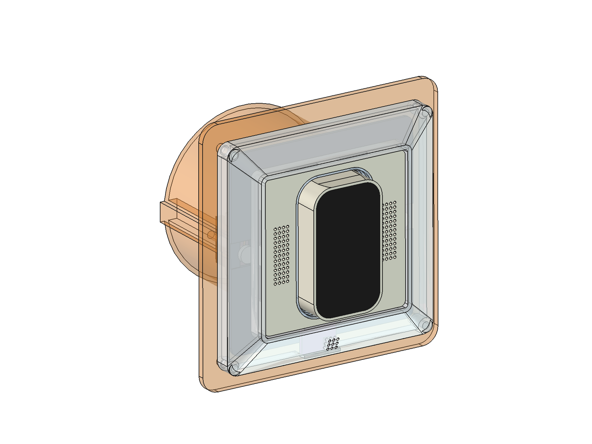

# Build guide: RoomKey desk prototype (kit, parts v0.10.3)

> **WIP prototype, for the desk only.** Never put it in a wall and never connect it to 230 V. Power comes from a lab
> supply. Nothing here is certified or reviewed. The in-wall product is designed in [docs/insert-design.md](docs/insert-design.md).

The kit is the whole RoomKey in **one** flush box: touch key, speaker, microphone, presence radar, amplifier and a
humidity sensor in the frame. It goes into a printed **practice box**, a flush-box replica with a 1-gang frame, so it can
be built and tested on the bench.



## Status (2026-10-08)

| Part | State |
|---|---|
| Practice box + frame | printed and fitted ✓. Frame vents centred |
| Chassis (3 glued parts, v0.10), plate, switch plate (glued) | printed and glued ✓ |
| Key: touch board in a rigid one-piece shell on two MX switches (v0.9) | printed, **fits perfectly** ✓ |
| Collar (light guide), v0.10.3: 0.15 mm wider inside, the key scraped | not printed yet |
| Back carrier, v0.10.2: amplifier pins 13.435 apart, radar play 0.10 | not printed yet |
| End-press binding of the key (desk test R1) | not tested yet |
| Radar range through the plate | not tested yet; this is the key test |
| Audio (mic, speaker loudness), glow ring | not tested yet |

## 1. What you need

**Bought parts:**

| Part | Notes |
|---|---|
| Waveshare ESP32-C6-Touch-LCD-1.47 (touch board) | the key's face. 24.55 × 44.50 × 10.6 |
| 2 × MX-style key switch, plate mount (3-pin) | under the key; both are one key in the firmware |
| HLK-LD2410C presence radar | 15.84 × 22.03; header soldered |
| MAX98357A I²S amplifier breakout | mounting holes 2.2; solder the speaker to its pads, not the screw terminal |
| Waveshare 2030 cavity speaker | 19.3 × 29.8 × 4.6 (sold as a pair on one plug) |
| INMP441 microphone module (round) | Ø13.1 |
| SHT31-D humidity/temperature breakout | sits in the frame's bottom border |
| 4 × WS2812B-MINI 3535 LEDs | glow ring |

There is no light sensor in the RoomKey (decided 2026-10-06). Every measured dimension and its source are in
[`cad/roomkey_params.py`](cad/roomkey_params.py).

**Small parts:**
- 4 × M3 × 8 for the frame;
- 4 × M2 × 4 countersunk for the touch board;
- 2 × device screws 3.2 × 15 (or M3 × 16) for the insert;
- 2 foam rings for the mic tube, 3.5 outside and 1.5 inside: **2 mm** thick at the plate end, 0.8 at the module end;
- gel cyanoacrylate glue (CA) and hot glue;
- 0.05 mm² silicone wire, plus thicker wire for the 5 V node (see the wiring doc);
- a lab supply.

## 2. Print

Everything is in **[print/README.md](print/README.md)**: the part list (material, orientation, supports), the
**ready-to-print Bambu Lab A1 files** for a 0.4 and a 0.2 nozzle, and the fits found on real prints. In short:

- **white PETG** for everything except the collar, which is **clear PLA**;
- every part prints flat **without supports**, except the key shell. Its supports sit in the board pocket, with
  **PLA as the support interface** so they come off clean;
- slow and precise: 0.10 mm layers, outer walls 25 mm/s.

The practice box and frame print as before (PETG, no supports, 0.20 mm layers):

| File in [`models/`](models/) | Part |
|---|---|
| `practice_box_print.stl` | practice box (box + "wall" plate) |
| `practice_frame_1x_print.stl` | 1-gang frame, AS 500 size, with the sensor pocket |

## 3. Assemble

Glue with **gel CA**, used sparingly and only on faces that touch. Roughen them with fine sandpaper first.

1. **Frame:**
   - Lay the SHT31-D flat into the pocket behind the frame's bottom border: chip side forward, pins to the left (front
     view). Fix it with a dot of hot glue, not on the chip.
   - Screw the frame to the practice box with 4 × M3 × 8 from behind.
2. **Chassis (2a front, 2b flange, 2c rear):**
   - Put 2a on 2b and **push the collar through both openings**: it aligns them. Glue the ribs and rims from the
     outside, not at the collar opening. When the glue has set, take the collar out.
   - Put 2c onto the two pins of 2b and glue the web tops. If a pin does not go in, drill its hole to 1.5 mm, or cut
     it off and align by eye.
3. **Switches:**
   - Clip both MX switches into the switch plate and wire them.
   - Lay the plate onto the ledge in 2c, from the front, and fix it with 2–3 dots of CA. The switches still pull out to
     the front.
4. **Key:**
   - Lay the touch board into the key shell from behind and screw it in with 4 × M2 × 4.
   - Press the key straight onto both switch stems, like a keycap. The top socket is tight; the bottom one floats a
     little along the key's length, on purpose.
   - Slide the collar over the key from the front; its grooves take the key's catch nubs. Do **not** glue it.
   - Put the plate on. The plate holds the collar, and the collar holds the key captive.
5. **Speaker:** slide it in from behind with its **wire tab pointing up**, into the slot of the upper cradle rib.
6. **Mic:** put the 2 mm foam ring on the plate end of the sound tube and the 0.8 mm ring on the other end. Press the
   INMP441 into its holder (upper left, behind the ledge): labelled side forward, port on the tube.
7. **Back carrier:**
   - Lay the radar into the tray: **antenna side forward, header towards the box wall.** It rests on two ledges at its
     short ends. Fix two corners with hot glue.
   - Push the amplifier onto its two pins, components to the back.
   - Push the carrier onto the four pins and fix it with a drop of glue.
8. **Wiring:** follow [`../docs/wiring-touch-board.md`](../docs/wiring-touch-board.md). It has every pin, the shared
   lines, wire gauges and the **5 V node** for bench power, and it is checked against the firmware.
   [`models/kit-v0.10.3_wiring.json`](models/kit-v0.10.3_wiring.json) holds 3D-routed lengths from an earlier per-part
   plan; use them only as length estimates.
9. **Into the box:** slide the insert into the practice box and fix it with the 2 device screws.

**Service:** the plate comes off first, then the collar, then the key. The touch board comes out of the key shell by
pushing it through a screw hole.

## 4. Power and first tests

- **Power:** set the supply as described in "Power without USB" in the wiring doc. That is 5.0 V, with the current limit
  raised once the amp and LEDs are on. The 5 V goes into the node at the parts; the board's VBUS gets it through a
  Schottky diode. Never apply 12 V to the 5 V node.
- **Tests:**
  - **Key:** press it every 5 mm along its length and many times at both ends (test R1). Every press must click and
    come back; nothing may stick. The key must not fall out.
  - **Touch:** taps and swipes must not trigger the key.
  - **Radar:** compare the range with and without the insert in front.
  - **Speaker:** compare a chime at full volume with your doorbell, using a level app at 1 m.
  - **Mic:** check the level.
  - **Humidity:** check that the reading follows the room.

## Regenerate the files

All parts come from Python scripts; see [README.md](README.md). Run headless, from the repo root (macOS path shown; on
Windows use `C:\Program Files\FreeCAD 1.1\bin\FreeCADCmd.exe`):

```bash
FC=/Applications/FreeCAD.app/Contents/Resources/bin/FreeCADCmd
for f in make_key_module make_insert_S make_practice_box make_kit; do
  PYTHONIOENCODING=utf-8 $FC -c "exec(open('hardware/cad/$f.py', encoding='utf-8').read())"; done
```

Each run prints its collision, clearance and print checks. They must report 0 collisions, the key check must report
"CAPTIVE", and the radar tray "CLOSED". `python tools/bambu_kit.py` then rebuilds the Bambu files (Windows, Bambu
Studio installed).
