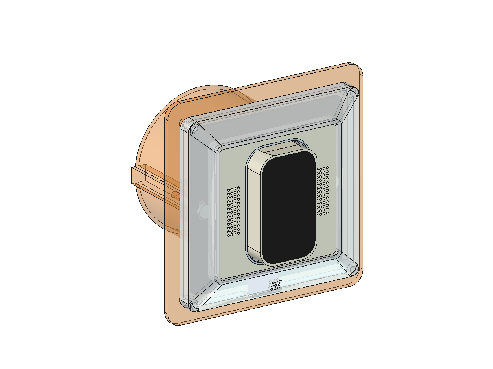
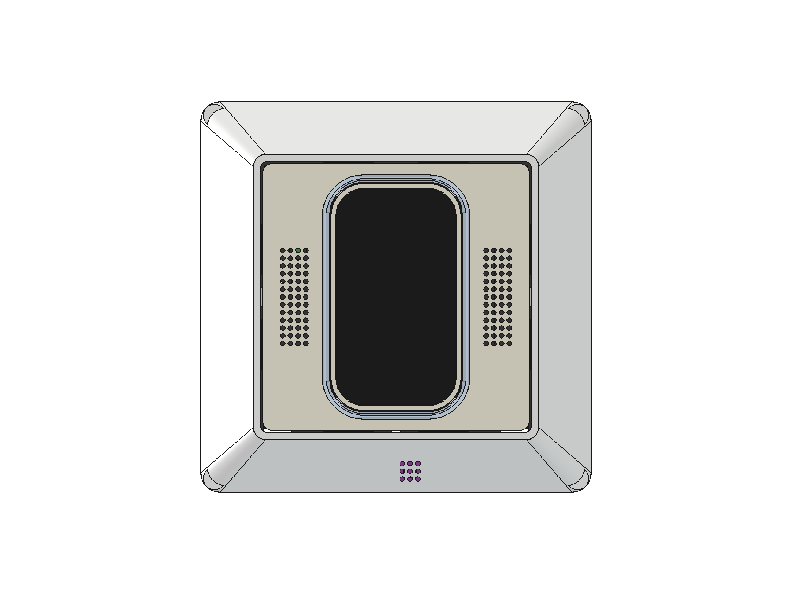
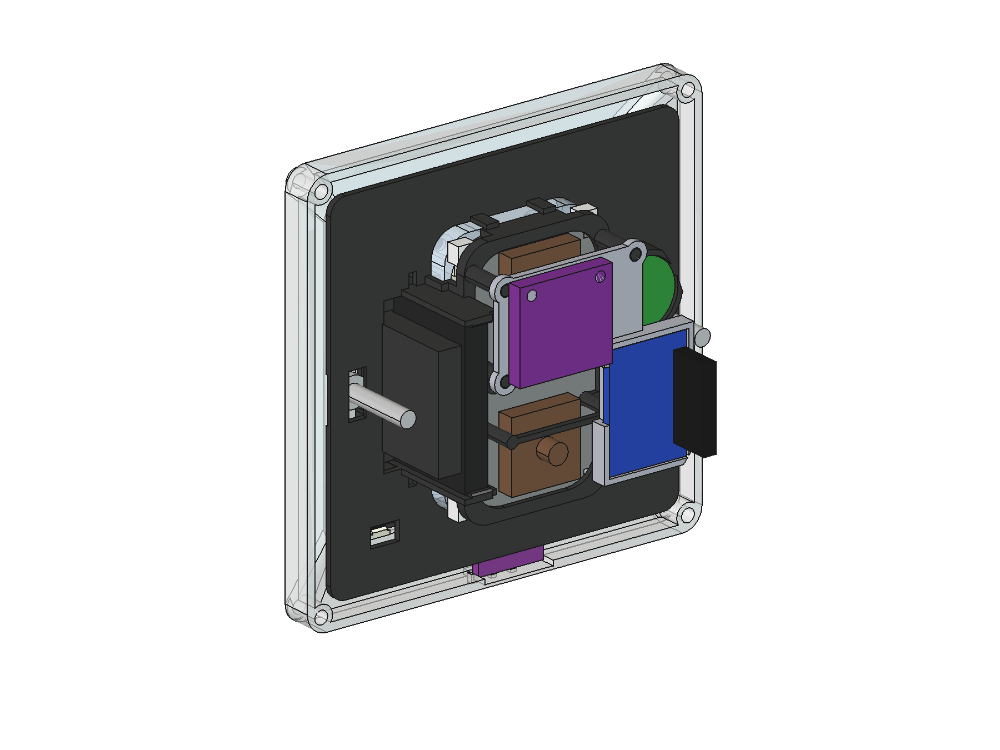
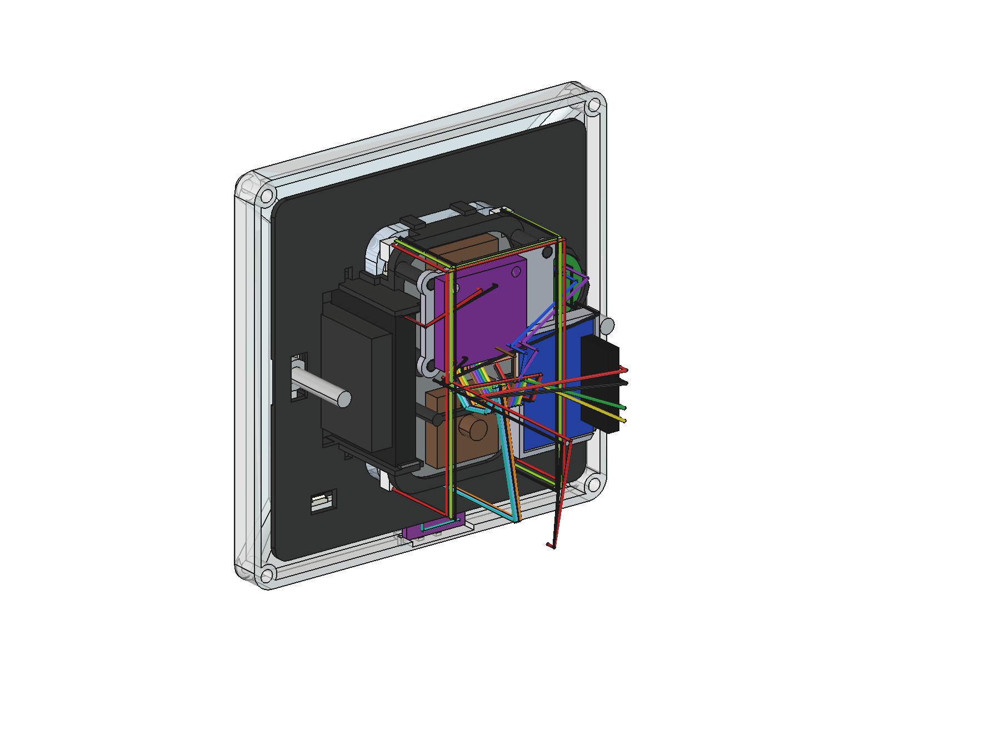
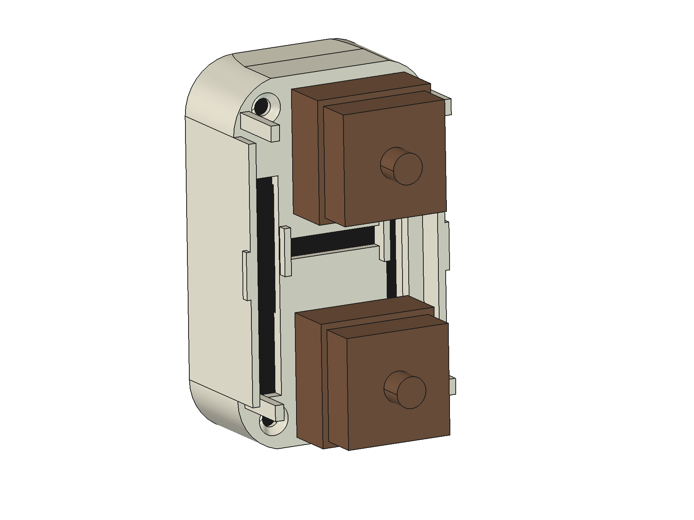
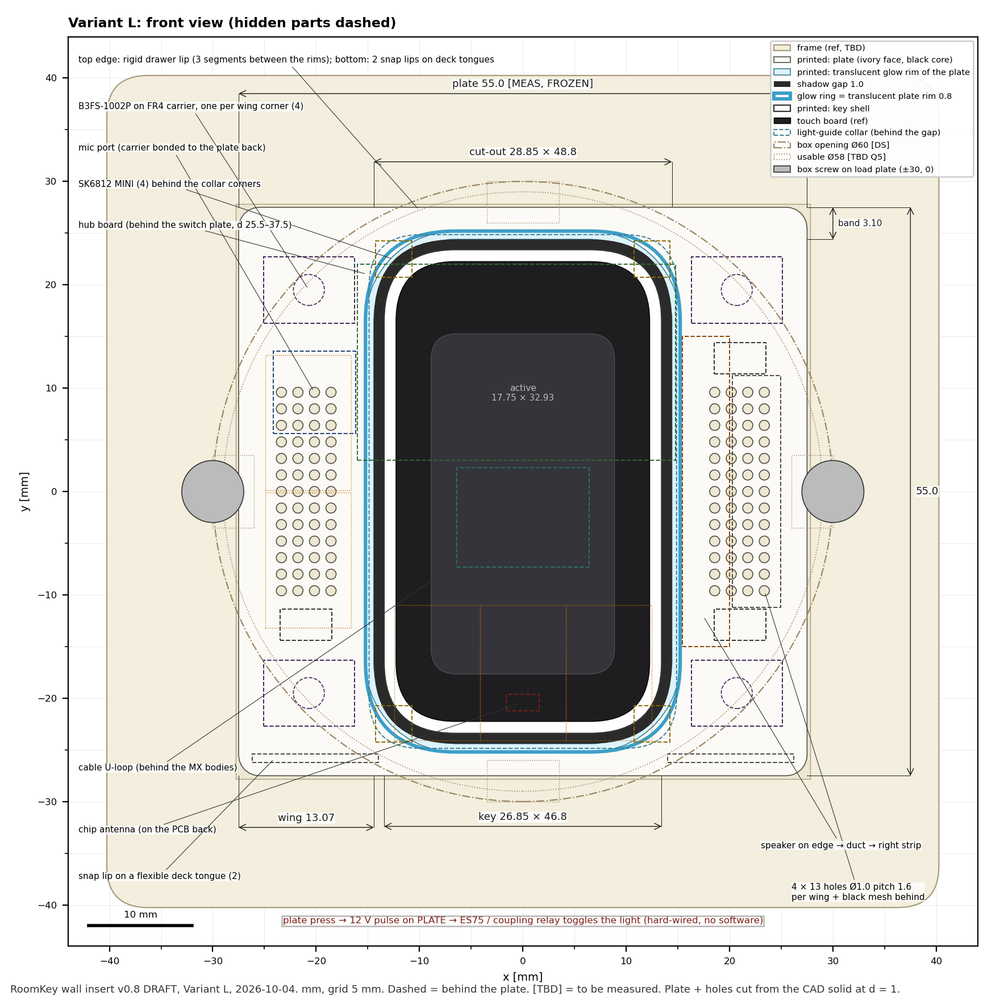

# Hardware

Parametric FreeCAD scripts, the same method as [Klingelbox](https://github.com/aikos-home/intercom):
one file holds every dimension, generators read it, `validate()` checks the fit before anything is
printed. Licence: [CERN-OHL-P-2.0](../LICENSES/CERN-OHL-P-2.0.txt).



*Kit v0.7 (prototype, WIP, not reviewed): the whole RoomKey in one flush box — touch key, speaker, mic, presence radar,
amplifier, humidity sensor — behind a 1-gang frame. Practice box shown transparent. Real FreeCAD screenshots, made by
[`cad/render_kit.py`](cad/render_kit.py) from the same scripts that write the print files.*

## How this hardware is made — one person and Claude

Everything in this folder comes out of a loop between **one person** (the owner: parts, printer, hands, decisions) and
**Claude** (Anthropic's AI, working in Claude Code: CAD scripts, arithmetic, checks, documentation). Together that covers
the jobs of a small product design team — industrial design, mechanical CAD, tolerance analysis, print engineering,
technical writing and design review. **In practice the owner runs a one-person product design studio.**

**One turn of the loop** (often the same evening, from "this is too tight" to a new print file):

1. **Say it from the bench, in plain words.** Usually one sentence and a phone photo: *"the board fits perfectly but I
   can hardly get it out"*, *"we have two switches — let the key rock so each can be pressed alone, and a press in the
   middle must still do something"*, *"everything goes into one box, except the power supply"*.
2. **Measure the real part.** Calliper values and photos of every module that goes in (speaker, radar, amplifier,
   sensors, the touch board, the wall frame). Each number lands in a parameter file with a tag — **[MEAS]** measured,
   **[DS]** data sheet, **[FREE]** design choice, **[TBD]** assumption — so it is always clear what is known and what is
   a guess. When a value cannot be measured, Claude researches it (vendor drawings, data sheets) and marks it [TBD].
3. **Change the parameters, not a drawing.** Claude edits the parameter files and the FreeCAD generator scripts. No part
   is drawn by hand: every solid, drawing and screenshot is rebuilt from code, so a 0.4 mm change ripples through
   all parts at once.
4. **Let the checks say no before the printer does.**
   - `validate()` runs more than 160 rules per variant (0 errors before anything is exported).
   - Every pair of parts is checked for collisions at rest, key pressed, key rocked both ways and wobbled.
   - Minimum wall thickness of the printed parts, and clearances reported in millimetres.
   - For the kit, all 41 wires are routed in 3D and checked against the parts; their cut lengths come out as a table.
5. **Hand over print files.** STL per part in print orientation, plus a short print sheet (material, nozzle, layers,
   supports, order) and a wiring sheet. All on one bed of a Bambu Lab A1, PETG.
6. **Print, fit, report back.** The owner prints, tries the real parts and sends the result — which is the next step 1.
   The checks do not catch everything. At the first kit assembly the rocker key simply fell out: the stem forks had been
   sized from a clearance dimension and clamped nothing. The next turn added a catch to the collar, plus a CAD check that
   pulls the key out and must fail to get it free.
7. **Review.** Larger revisions go through independent adversarial review rounds: fresh AI reviewers try to break the
   design, and every finding gets a fix or a stated assumption with a test and a fallback
   ([review log](reviews/insert-v0-review-log.md)).

**Rules that hold in every turn.**
- **Safety:** the parts here are extra-low voltage (SELV) only. Everything on 230 V is a certified device, installed by a
  qualified electrician — Claude does not design mains parts, even when asked.
- **The owner decides.** Claude proposes; when a proposal is wrong, it is dropped. Example: Claude moved the sensors into
  a second box to make room; the owner said *"everything in one box"*. The result, kit v0.7, is better: the radar looks
  through the left wing of the plate, the mic hears through a sound tube, and the humidity sensor sits in the frame
  (the owner's idea).
- **WIP is labelled WIP.** Nothing here is built to a standard or certified. Untested features say so.
- **Interfaces are agreed, not guessed.** The pin plan of the kit was checked against the RoomKey firmware by the
  firmware side before it went into this repository.

| | |
|---|---|
|  |  |
| *What you see on the wall: frame, plate with speaker and mic perforation, touch key with glow ring; humidity-sensor vents in the frame.* | *From behind: back carrier with the LD2410C radar (blue) and MAX98357A amplifier (purple), INMP441 mic (green), speaker, the two key switches.* |
|  |  |
| *All 41 wires of the kit, routed in 3D (0.05 mm² silicone wire; cut lengths in [`models/kit-v0.7_wiring.json`](models/kit-v0.7_wiring.json)).* | *Rocker key from behind: two key switches read separately — rock up, rock down, or press the middle for both.* |

| File | What |
|---|---|
| [`cad/roomkey_params.py`](cad/roomkey_params.py) | every dimension, tagged [DS] datasheet · [MEAS] measured · [FREE] design choice · [TBD] placeholder; `python3 cad/roomkey_params.py` runs the fit check |
| [`cad/make_coupon_v0.py`](cad/make_coupon_v0.py) | tolerance coupon — print this first |
| [`cad/insert_params.py`](cad/insert_params.py) | **wall insert v0.8 (draft)**: box, frame, both variants, installation topologies; `python3 cad/insert_params.py` validates L and S |
| [`cad/insert_lib.py`](cad/insert_lib.py), [`make_key_module.py`](cad/make_key_module.py), [`make_insert_L.py`](cad/make_insert_L.py), [`make_insert_S.py`](cad/make_insert_S.py) | FreeCAD generators + collision/clearance checks (rest, key pressed, rocked and wobbled with its stems, plate pressed at five points) |
| [`docs/insert-design.md`](docs/insert-design.md) | **design of the wall insert (v0.8 DRAFT)**: concept, stack-up, installation topologies (electrician), BOM, printing, open questions, risks |
| [`cad/desk_lib.py`](cad/desk_lib.py), [`make_practice_box.py`](cad/make_practice_box.py), [`make_desk_replica.py`](cad/make_desk_replica.py) | **practice box v0.1** (one flush-box replica + 1-gang frame with the humidity sensor) and the older 2-box desk replica — prototypes, never in a wall |
| [`cad/kit_lib.py`](cad/kit_lib.py), [`make_kit.py`](cad/make_kit.py), [`wiring_lib.py`](cad/wiring_lib.py) | **kit v0.7 (WIP)**: the whole RoomKey in one box — back carrier (radar + amplifier), mic sound tube, 41 wires with cut lengths |
| [`cad/view_kit.py`](cad/view_kit.py), [`render_kit.py`](cad/render_kit.py) | open the kit in the FreeCAD GUI (coloured, grouped) and render the images in [`docs/img/`](docs/img/) |
| [`drawings/`](drawings/) | to-scale front views and sections cut from the CAD solids (`tools/insert_drawings.py`) |
| [`reviews/insert-v0-review-log.md`](reviews/insert-v0-review-log.md) | pre-mortems, independent adversarial reviews, scores, resolutions |
| `models/*_print.stl` | ready to slice · `models/*.step` for editing |

Generate (headless, from the repo root):

```bash
PYTHONIOENCODING=utf-8 /Applications/FreeCAD.app/Contents/Resources/bin/FreeCADCmd -c "exec(open('hardware/cad/make_coupon_v0.py', encoding='utf-8').read())"
```

## Coupon v0 — find the fits first

Print flat, PLA, 0.2 mm layers, no supports (≈ 10 min, 9 g). Dots = variant, 1 dot = left.

| Row | Test | Variants (1 / 2 / 3 dots) | Pick |
|---|---|---|---|
| A (switch cut-outs) | press a key switch into the 1.5 mm plate | 13.9 / 14.0 / 14.1 mm | clicks in firmly, no wobble |
| B (mic seats) | drop the INMP441 in | Ø 13.25 / 13.35 / 13.45 mm | goes in without force, doesn't fall out |
| C (stem sockets) | press onto a switch stem | 4.05×1.25 / 4.10×1.30 / 4.15×1.35 mm | snug, no cracking |

The winners go into `roomkey_params.py` as [MEAS]. Repeat in ABS/PETG before the final parts —
they shrink differently.

## Wall insert v0.8 (DRAFT / WIP, 2026-10-04)

**AI-assisted draft — nothing built, nothing certified, not approved for mains. All 230 V work only by a
qualified electrician of a registered installation company (NAV §13).** Two variants of the in-wall part with the same printed parts, key module and look —
see [docs/insert-design.md](docs/insert-design.md):

* **The insert is SELV-only (12 V in).** No 230 V, no power supply, no relay in the RoomKey chamber; the
  230 V side is certified devices placed by the electrician (where the switch leg ends, behind the partition of a
  two-chamber box, or in the distribution board — decision procedure in the design doc §9). At the common 2-core
  switch leg this usually means a new cable.
* **Variant L — light-switch replacement.** The ivory plate floats on four SMD tactile switches (B3FS) and is a
  push-button: 12 V SELV pulse → certified impulse relay → the light works without Wi-Fi, HA or ESP (and with any
  fault behind the hub's eFuse; FMEA in the design doc §8.2). The glow lights the gap around the key and a
  translucent rim of the plate.
* **Variant S — socket replacement.** Same parts; the plate goes to the ESP only; the socket at that
  position is lost; only sensible at a usable height.

v0.6 adds the owner's first fit test, the rocker key and wider wire slots. v0.8 makes the rocker key captive after the first kit assembly, where it simply fell out (design doc §0, §3). Neither was reviewed.
Status: **WIP — the adversarial review gate was NOT passed** (4 rounds, scores ≈ 7/10; the remaining MAJOR items need
real parts, a desk rig and measurements — see the review log). CAD closes in all checked states (0 collisions at rest, key pressed, key rocked both ways, key + stems wobbled ±1.5°,
plate pressed at five points to the nominal and worst-case stop), `validate()` 0 errors, wall check passes. Blocked on
measurements (rocker-to-wall distance ≥ 8.9 mm, frame retention, box interior, conductors behind 5 WAGOs — plan with a
47 mm box), desk-rig tests (key end presses, touch vs key, glow look, mic path, start-up, relay drive at reset) and six
questions to Eltako — list in the design doc §10 and §13. Print
[`make_coupon_v1.py`](cad/make_coupon_v1.py) (switch seat and snap tongues, stem posts, perforation, colour) and the
key shell + switch plate for the end-press test before any other real part.

| More files | |
|---|---|
| [`cad/make_coupon_v1.py`](cad/make_coupon_v1.py) | coupon v1 for the insert mechanics (rows D, E, F, H) |
| [`../tools/insert_drawings.py`](../tools/insert_drawings.py), [`../tools/insert_wallcheck.py`](../tools/insert_wallcheck.py) | drawings and minimum-wall check (any python with numpy + matplotlib, e.g. FreeCAD's bundled one) |



## Plan

**Now (2026-10-04):** first chassis printed and fitted; rocker key and practice box + kit v0.7 ready to print;
parts for the kit arriving. Next: wire the kit on the bench, test the radar through the plate, then the next insert revision.


1. **Coupon v0** — fits for this printer (now)
2. **Desk rig v0** — 55 × 55 rocker face, touch board as the key on two identical MX switches wired in
   parallel (end-press test first, design doc §10), a switch under the rocker as the room-light stand-in (logs only, no mains), speaker on
   its edge with a sound duct, mic, amp, glow LEDs, USB power
3. **Wall fit v1** — same parts inside the real limits (Ø58 box, depth) + a printed dummy flush box
4. **Mounting v2** — screw holes at 60 mm; supply and relay stay outside the RoomKey chamber (SELV-only
   insert) — then the electrician (the v0.5 insert draft models this: [docs/insert-design.md](docs/insert-design.md))
