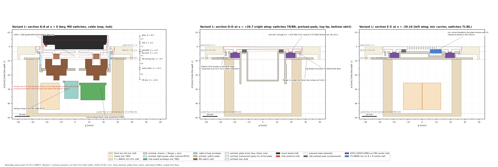
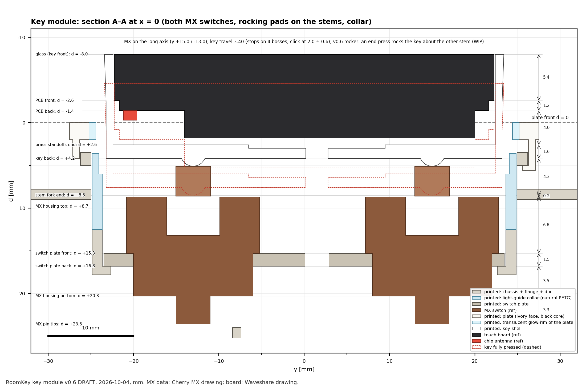
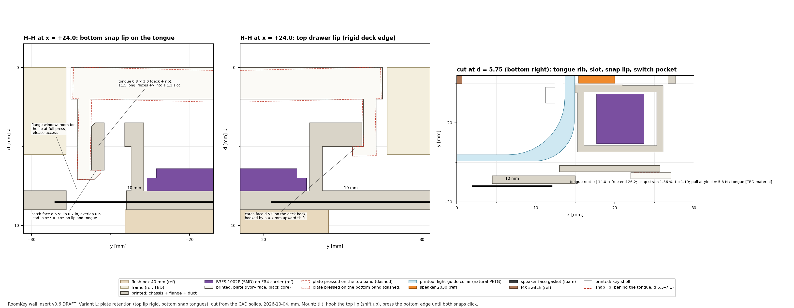
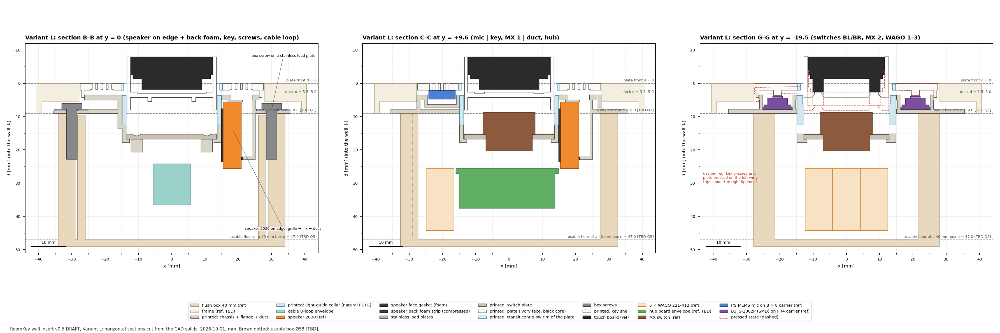
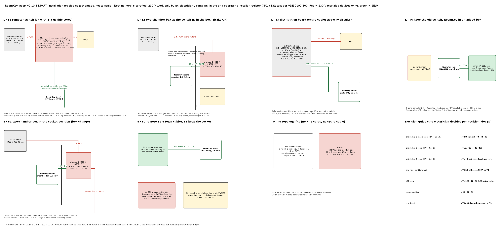

# RoomKey wall insert — v0.10.1 (Variant L and Variant S)

> **DRAFT / WIP. AI-assisted design. Not built, not tested, nothing certified.**
> - The insert is a **SELV-only (class III) device**: it never carries 230 V.
> - Everything on the 230 V side is a certified product, installed and tested by a **qualified electrician of an
>   installation company entered in the grid operator's installer register** (NAV §13). Never by the owner, never with
>   parts from this repository.
> - Nothing here is approved for mains.
> - **Review status:** four rounds of independent adversarial review; the quality gate was **not** passed. v0.5 fixes
>   the round-4 findings but was **not** reviewed again — the remaining MAJOR items need real parts and measurements
>   ([review log](../reviews/insert-v0-review-log.md)).
>
> - **v0.6** adds the owner's first fit test, the rocker key, wider wire slots and the kit v0.7 prototype (§0). **v0.8**
>   makes the rocker key captive after the first kit assembly (§0, §3). **v0.9** drops the rocker: a rigid key on two
>   MX with a fixed and a floating socket (§0, §3); **v0.9.1** fixes the speaker tab and the radar tray after the
>   first kit fit, **v0.9.2** closes the radar tray again, **v0.9.3** fits it to the board; **v0.10** makes every part print without supports (§0, §11). None of these was reviewed. (There is no insert v0.7; v0.7 is the kit.)
>
> Date: 2026-10-01, v0.6 and v0.8 2026-10-04, v0.9 2026-10-05, v0.9.1 to v0.9.3 2026-10-06, v0.10 2026-10-07. Licence: CERN-OHL-P-2.0 (hardware), CC BY 4.0 (this text).

**What it is.** The insert replaces the 55 × 55 mm rocker of a German flush-mount switch (or socket) position and
keeps the frame.
- **Key:** a touch board is the keycap. It stands 8 mm proud on two MX switches, framed by a 1 mm gap around which
  the **glow ring** lights up.
- **Plate:** the ivory plate around the key carries the speaker and the microphone behind two perforation strips.
- **Light switching (Variant L):** the plate is also a push-button. It switches the room light through a certified
  impulse relay, **without any software in the path** (north star: [`../../docs/north-star.md`](../../docs/north-star.md)).

| | **Variant L — light-switch replacement** | **Variant S — socket replacement** |
|---|---|---|
| Printed parts | identical: key shell, switch plate, collar, plate (with glow rim), chassis | identical |
| The plate | floating push-button on 4 tactile switches → 12 V SELV pulse on the PLATE line → certified impulse relay **outside** the RoomKey chamber (hard-wired, no software) | same mechanics; the PLATE line goes only to the ESP (HA maps it to the room light — needs a smart light — or a scene); the socket at this position is lost |
| 230 V | only in certified devices: where the switch leg ends (T1a/T1b), in chamber 2 of a two-chamber box (T2), or in the distribution board (T3) — §9 | only in chamber 2 of a two-chamber box (S1) or elsewhere (S2) — §9 |
| In the RoomKey chamber | SELV only: +12 V, 0 V, PLATE | SELV only: +12 V, 0 V |
| Box | **plan with a 47 mm deep box** (box change = plaster work). A standard 40 mm box only if the wall-fit test passes: the parts and 5 × WAGO 221 need ≥ 37.2 mm, but the solid cores probably cannot bend into 2.8 mm (§8.1) | same; only at heights ≥ 70 cm (§9.4) |
| Precondition | a 12 V SELV feed and a relay path must exist. At the common 2-core switch leg (NYM-J 3×1.5) this usually means a **new cable** (§9.2) | a 12 V SELV feed (§9.3) |

**Glossary.**

| term | meaning |
|---|---|
| SELV / class III | safety extra-low voltage (here 12 V DC from a safety-isolating source); a class III device runs only on SELV |
| PE, N, L | protective earth, neutral, line (phase) |
| MCB, RCD, SPD | circuit breaker, residual-current device (30 mA), surge protective device |
| TN-C | old wiring without a separate PE ("klassische Nullung") |
| B3FS, MX | Omron SMD tactile switch (plate); Cherry-MX-style key switch (key) |
| OF, RF, PT | operating force, release force, pretravel of a tactile switch |
| nub gap | air gap between a nub on the plate back and its switch plunger at rest |
| RSS | root-sum-square tolerance stack (statistical); "worst case" = plain sum |
| CLD40 | compression load deflection of a foam at 40 % compression |
| PTC, TVS, eFuse | self-resetting fuse, transient-voltage clamp diode, electronic current limiter |
| FMEA | failure-mode list: what each part's failure does |
| AMS | Bambu multi-material unit (several filaments in one print) |
| d | depth into the wall, d 0 = plate front (§1, coordinates) |

## 0. What changed

**v0 → v0.2 (review round 1: 7 BLOCKERs).** The insert became **SELV-only**; 230 V moved into certified devices
outside the chamber. Floating plate on 4 tactile switches; light-guide collar; mic carrier; U-loop cable.

**v0.2 → v0.3 (round 2: no BLOCKER, ~28 MAJORs).** No foam gaskets between plate and chassis (mic carrier bonded to
the plate, speaker sealed at its grille); glow = translucent plate rim; flange datum + tolerance chain + shims; 8 frame
rims; stainless load plates; T0/T4 and the switch-box inventory; hub GPIO map from the vendor schematic.

**v0.10 → v0.10.1 (owner's print, 2026-10-08: the 2→3 pins did not go into their holes).** The holes open on part 3's
bed face, where the first layers' squish closed the Ø1.4 mouths (0.1 play). Now 0.15 play, a 0.25 × 45° lead-in at
the mouth (`CH_PIN_LEAD`) and a 0.3 point on the pin. Printed v0.10: drill the two holes to 1.5.

**v0.9.3 → v0.10 (owner, 2026-10-07: the whole kit printed with a 0.2 nozzle at 30 mm/s, PETG supports with a PLA
interface — the key shell and the chassis still broke when the supports came out. "Open to gluing (CA) or pin → hole").
WIP: modelled, CAD-checked, not printed.**
- *Why they needed supports (overhang survey, front down):* the key shell's back wall is a 25 × 45 roof over the board
  pocket. The kit chassis: the mic tube stood 1.0 in front of the deck and was the only thing on the bed — the whole
  deck floated; the 71 × 71 flange overhangs the body by ≈ 9.5 all round (≈ 2500 mm²); the rear wall behind the collar
  hangs over the collar seat (a 32 mm bridge on the speaker side, no room for a post); the switch-plate screw bosses and
  the cable-anchor posts hang 3–5 mm free from the ledge.
- **Key = 2 prints** (`key_shell_parts()`): a **ring** (walls, skirts, catch nubs) and a **back plate** (back wall, posts,
  sockets, stop bosses) that sits inside the ring like a lid (0.1/side, `KEY_PLATE_CLEAR`) — the fit locates it, CA from
  behind; the 4 board screws hold board and plate as before. No room for pins in the 1.0 walls; none needed.
- **Chassis = 3 prints** (`chassis_parts()`, all variants): **1 front** (d < flange front: deck, pockets, rims, mic tube),
  **2 flange** (flange + webs to the collar's back face + the speaker duct), **3 rear** (rear wall, ledge, speaker cradle,
  hub posts). Joints: 1→2 glued with the collar through both openings as the jig; 2→3 on **two pins Ø1.2**
  (`CH_PIN_POS` (±5.7, ±26.25), on the island ribs — the only free spots: the plate's tactile switches sit at the corners,
  the speaker on +x, the box's screw domes on the axes) + the web tops, CA.
- **Switch plate glued** onto the ledge (owner's choice) — no screws, no bosses (`SWP_SCREWS = ()`); the **cable anchor**
  (posts + bar) now stands on the switch plate's back.
- **Kit mic tube** flush with the deck front: foam at the plate end 1.5 compressed (`KIT_MIC_FOAM_FRONT`), the module end
  unchanged; the module shelf filled down to the rear part's front face.
- **Frame rims** tied to the deck by webs in the plate-skirt gaps (they print with the front part).
- **Every part prints front down** (collar back down, as before). New check `ceilings()` in every build: planar faces that
  face the bed must be short bridges (span ≤ 16, measured as min(bbox, 4·area/perimeter)); now the widest is 8.7 (the
  insert's mic pocket roof), the kit's 5.7. L, S, kit: 0 collisions, nothing trimmed, key captive, radar tray closed.
- *Open:* the amplifier pins on the carrier — unchanged in CAD since v0.8 (spacing 15.97 outer), but the 0.2-nozzle print
  came out a little too wide; the hole positions are only [PHOTO ±0.5] → owner to measure the two holes.

**v0.9.2 → v0.9.3 (owner's print, 2026-10-06).** The radar slid about in the v0.9.2 tray (≈ 0.5 too long, the short side
just too loose). The board is **22.03** long (caliper photo), not 22.26 (10-03): `RADAR_H` corrected, `KIT_RADAR` now
derived from `RADAR_W/H`, tray play 0.2 → **0.15/side** (= `KEY_FIT` [MEAS]). Pocket 16.14 × 22.33. Kit: 0 collisions,
frame closed.

**v0.9.1 → v0.9.2 (the owner's slicer view and a photo of the radar's antenna face, 2026-10-06; WIP, not printed).**
- *My error in v0.9.1:* the full-width antenna window removed the plate strip under the board's parts edge; next to it
  the cable-loop keep-out (x ±7) takes the tray's +x wall over y −7.8…2.5, so the tray became an open "C" — the floppy
  shape v0.8 had fixed. No check caught it (no collision, still one solid).
- *The photo:* SMD parts run along the **whole** long edge opposite the header, corners included, up to ≈ 4.1 from it;
  the chip reaches 2.3 from that edge. So no plate strip can run under that edge with the board lying on the plate.
- *Fix:* the board sits on **two 1.3 mm ledges** at its short ends, header side only (11.0 from the header edge; the
  parts band starts at 11.6). Every part on the antenna face then floats ≥ 0.2 above the plate, the v0.8 window and the
  plate strip under the parts edge are back, and the tray is closed. Tray 1.3 taller. Reference envelopes from the photo
  (`KIT_RADAR_EDGE` 4.2 × 1.1 [TBD height]); the radar's front parts are no longer exempt from the collision check.
- *New check:* `build_kit` probes the plate strip along the parts edge over the keep-out's y range → "radar tray frame:
  CLOSED", else it fails. Kit: 0 collisions; edge parts ↔ carrier 0.2, pin stubs 0.5, chip 2.5.

**v0.9 → v0.9.1 (the owner's kit fit, 2026-10-06; WIP: modelled, CAD-checked, not printed).** Key, amplifier and
microphone fit as printed.

| Input | v0.9.1 |
|---|---|
| The speaker does not go in: a ≈ 0.5 mm wire tab at the centre of one short end hits the cradle rib. "A hole in one of the towers, not a fork (integrity)." | **Blind tab slot** in the +y cradle rib (towards the amplifier): open to the back (the speaker and its wires come from behind), closed to the front, 4.4 wide (tab 3.4 [TBD] + 0.5/side), 0.9 beyond the speaker end; the rib is thickened outward there so 0.8 of wall stays behind the slot. The +y snap hook is dropped (the slot cut its root and left it as a loose 2nd solid; at the round speaker end it caught nothing). `SPK_TAB` overhang 1.8 (photo) → 0.5 (owner). The speaker reference now carries the tab. New hard check: every printed part is exactly ONE solid. |
| The radar does not sit flat in the intended orientation (header to the wall): small SMD parts on the antenna face, along the long edge opposite the header, land on the carrier. (Turned by 180°, the header pin stubs do the same.) | The antenna **window spans the full board width** → the board rests only on its two short ends (1.5 / ≈ 3 mm). New references: "LD2410C edge parts" (`KIT_RADAR_EDGE` [TBD]) and "LD2410C pin stubs" (`KIT_RADAR_STUBS` [TBD]); both clear the carrier by 0.1. |

CAD: L, S and the kit 0 collisions; key still captive. Print folder `roomkey-bausatz-v0.9.1/` (new: chassis, carrier).

**v0.8 → v0.9 (the owner's verdict on the rocker, 2026-10-05; WIP: modelled, CAD-checked, not printed, not reviewed).**

| Input | v0.9 |
|---|---|
| "Die Idee mit der Wippe ist an sich schlecht. Es führt zu zu vielen Problemen mit der Integrität und Usability." Two problems: a rocking key on stem tops, skirts in the collar and stop bosses may scrape instead of gliding; and it did not stay in (v0.7 fell out, the v0.8 catch was a patch). | **Rigid key on the two MX** (the owner chose it from three options: this, one centre MX + a 2u stabiliser, a printed plunger). The forks and rocking pads are gone; the v0.5 **stem posts with cross sockets** are back (coupon v0 row C fit): **fixed** on MX1 (top), **floating** on MX2 (bottom: its y-arm slot runs through the post, its x-arm slot is 1.80 wide → the stem floats ±0.25 along y, so a pitch error cannot strain the two stems against each other). The key moves straight in and out only. — §3 |
| Keep the key captive | The **v0.8 catch** (nubs in the collar grooves) and the **4 stop bosses** (stop at 3.4, before MX bottom-out) stay unchanged; socket friction holds the key as well. CAD: 0 collisions in L, S and the kit; key pulled → **CAPTIVE**; MX2 shifted ±0.25 → its post still clears the housing window (0.10). |
| Top / bottom functions | Not needed by the firmware today: it already ORs both switches into one key (`key_raw`). If they are ever wanted, they come from the touch point at the click (the AXS5106L touch panel), not from the mechanics. Wiring unchanged (KEY1 = BOOT, KEY2 = IO6). |
| Still open | End-press binding (desk test **R1**) — the reason v0.6 went to the rocker. If R1 fails, the documented fallback is one centre MX + a 2u plate-mount stabiliser. |

**v0.6 → v0.8 (the owner's first kit assembly, 2026-10-04; WIP, not reviewed).**

| Input | v0.8 |
|---|---|
| "Nothing stops the rocker, with the ESP32 module, from simply falling out." | **Key catch:** a rigid nub on each side skirt runs in a groove in the collar's inner face. The groove is open to the back and closed towards the room, so the key is **captive**. The CAD check pulls the key and requires a hit, also when the key is shifted sideways. — §3 |
| Why: the stem forks clamped nothing. Their gap of 4.10 was the cross socket's slot length, which has play; the stem arm is ≈ 4.0. Even a tight fork is a weak spring, so friction alone cannot hold the key | fork gap 3.90 [TBD coupon] for a light pinch; retention comes from the catch, not from friction — §3 |
| The collar must come out for key service | **the collar is no longer glued**: the plate holds it. Assembly: key → collar → plate. The acoustic seam it used to seal is open (fallback: a thin foam ring) — §4, §11 |

**v0.5 → v0.6 (the owner's first print and wishes, 2026-10-02 … 04; WIP, not reviewed).**

| Input | v0.6 |
|---|---|
| First chassis printed (PETG, A1): the touch board fits "extremely perfectly" but is hard to get out; the USB port is no problem | removal = **push-out through the screw hole** (owner tried it: ok); no USB port in the insert — §3 |
| "Two switches — let the key rock so each one can be pressed alone; a centre press must still do something" | **rocker key**: both MX read separately (KEY1 / KEY2), centre press = both; forks, stop bosses and tapered ends; CAD checks rest, pressed, rocked both ways and wobbled — §3 |
| The cable slot under the display is too narrow; pins or wires must go straight back from the header holes | middle slot wider; **header slots** in the key back for pre-soldered pins or wires — §3 |
| Real speaker measured (19.32 × 29.81 × 4.57, stadium shape, paper-thin white ring) | reference body updated; hooks on the straight part are **still open** — §6.2 |
| WS2812B-MINI 3535 ordered (2.0 high) | LED corner notches in the switch plate — §6.3 |
| Production goal: print → plaster → silicone mould → UV resin | noted, not designed for yet; PETG for the prototypes — §10 |
| Whole RoomKey in ONE box, bench power from a lab supply | **practice box v0.1 + kit v0.7** (radar, amplifier, mic, humidity sensor in the frame, 41 wires) — §10 |

**v0.4 → v0.5 (round 4: no BLOCKER, 19 MAJORs; not re-reviewed).**

| Round-4 finding | v0.5 |
|---|---|
| "Works down to 7.6 mm rocker-to-wall" false: the retention needs ≥ 8.9 | Q1 threshold **≥ 8.9 mm**, derived in `validate()` from the pressed snap lips; below it: redesign (thinner deck/lips) — §2 |
| Misconnection text described one case; the fuse protects only +12 V with a low-impedance return; the most likely miswire (lamp as return) leaves the SELV side live | per-conductor **matrix** (§8.1); **RCD 30 mA and a voltage + insulation check before connecting are preconditions** (§9.1); fuse breaking capacity ≥ 1500 A, creepage around it; "SELV only behind the key" qualified |
| IO5 (RELAY_DRIVE) floats at reset → relay pulses at power-up / boot loops | 100 k pull-down + 20 ms qualifier ahead of the one-shot; desk-rig test R12; strapping list corrected — §8.2 |
| eFuse checked against the largest single load; named part cannot do 0.4 A; SNT61 trip point unknown | rule uses the **summed peak (0.37 A) with ±7 % tolerance**; 60 V-class eFuse, OVLO 17 V, SMBJ24A [TBD part]; light-path-vs-hub-short as BLOCKED-ON-DATA (Q4f, test R14, fallback) — §8.2 |
| RF spring distance had a sign error (8.1 mm pressed, not 11.5) | corrected, WARN, closer metal listed (contact leaves, cable wires) — §8.5 |
| Wall-check slices missed the speaker hooks (0.2–0.6 layer stack) | hooks 1.2 thick (tip 0.8); planes through every lip and hook; claim qualified — §10 |
| Touch gestures can fire the key; power-cut state (Q4e) without assumption/fallback; 40 mm box headline; owner measurements inside a 230 V box not flagged; stale mains-in-box text in the north star | each with assumption, test (R13, R15) and fallback; **47 mm box as planning default**; every question tagged owner / electrician, wall-fit prototype defined (§13); north-star note added |
| Mic wires squeezed under the carrier; coupon not in the V-0 chassis material; end-press fallback collides with the cable path | **mic wire well** beside the pocket with an S-loop and a foam plug (§6.1); coupon row D bases in the V-0 filament (§10); binding judged **likely**, both key modules for the first rig (§3) |

**v0.3 → v0.4 (round 3: no BLOCKER, ~15 MAJORs).** Full record: [`../reviews/insert-v0-review-log.md`](../reviews/insert-v0-review-log.md).

| Round-3 finding | v0.4 |
|---|---|
| End presses of the key: the 6–7° pitch model was physically impossible (two stems cannot tilt), the CAD check exempted the colliding pair, the stop bosses landed on a housing shape that does not exist | **Pitch model and stop bosses removed.** MX moved to (0, +15) / (0, −13): the key overhangs its stems by 8.4 / 10.4 mm, like a keycap edge. The key stops at MX bottom-out. CAD checks the key **and its stems** wobbled ±1.5° at rest and pressed, **without** the key ↔ housing exemption: 0 collisions. End presses beyond the stem play are a **desk-rig test** with a named fallback (stabiliser) — §3 |
| Shadow gap "stays dark" was false | Described as it is: **the gap glows** (it looks onto the lit collar); the rim glows dimmer. Decision Q12 with a mask fallback — §4 |
| Terminal zone held one WAGO | **5 × WAGO 221-412 modelled** (3 SELV joints, PE cap, spare-core cap) at d 25.6–44.2 → box ≥ 37.2 mm. Conductor bends: WARN + wall-fit test + fallback (47 mm box) — §8.1 |
| T1 cost/feasibility understated | T1 split into **T1a** (lamp / ceiling box) and **T1b** (wall junction box → new box, plaster work); ES75 needs **≤ 10 A protection** (B16 → B10 or a fuse); luminaire responsibility; T1-LED enclosure sized from the parts (≥ 95 deep) — §9 |
| Switch datum on solder over an unsupported ledge | **SMD B3FS-1002P** on a **flat-backed** carrier; wires soldered from the back into a slot in the flange; the seat's bridge sag is a term in the chain — §5.1 |
| Speaker not located in x; "front volume opens only to the room" false | **Foam strip behind the speaker** presses it onto its face gasket; hooks got a lead-in; leak paths listed honestly — §6.2 |
| A hub fault stopped the light; "cannot exceed the B3F rating" false | **eFuse (0.4 A) on the hub branch**, RELAY_DRIVE through a series Schottky, FMEA of the +12 V / PLATE nodes, claims rewritten — §8.2 |
| 230 V misconnection understated | **250 V AC entry fuse** ahead of everything; **UL94 V-0 chassis mandatory**; text says what really happens — §8.1 |
| SNT61 start-up and mic path untested, no fallback | Assumption + test + fallback for both — §6.1, §8.3 |
| Coupon printed differently from the parts | **0.10 mm layers for plate, chassis and coupon**; support blockers in the carrier pockets; coupon has the pad and the real B3FS seat — §10 |
| Wires inside the key had zero margin | 0.4 mm channel in the key back → 1.2 mm clearance — §3 |
| Many smaller items (press force counted touching switches, plate ↔ frame only at rest, wrong tongue stiffness, firmware power-save, coupled boxes, 411.3.3, chamber-2 accessibility, glossary, drawing captions, S-specific questions …) | fixed or turned into stated assumptions with a test and a fallback; see the review log |

## 1. Files and how to regenerate

| What | Where |
|---|---|
| every insert dimension + `validate()` (both variants) | [`../cad/insert_params.py`](../cad/insert_params.py) (imports [`../cad/roomkey_params.py`](../cad/roomkey_params.py)); sources in `SOURCES` |
| FreeCAD part builders, collision/clearance checks, section export | [`../cad/insert_lib.py`](../cad/insert_lib.py) |
| generators | [`make_key_module.py`](../cad/make_key_module.py), [`make_insert_L.py`](../cad/make_insert_L.py), [`make_insert_S.py`](../cad/make_insert_S.py), [`make_coupon_v1.py`](../cad/make_coupon_v1.py) |
| models | `../models/` (details below) |
| drawings (to scale, cut from the CAD solids) | [`../drawings/`](../drawings/): `insert-{L,S}_front`, `_sections`, `_plan-sections`, `_layers`, `_retention`, `key-module_section`, `insert-topologies` (schematic) |
| minimum-wall check of the printed parts | [`../../tools/insert_wallcheck.py`](../../tools/insert_wallcheck.py) |
| review record | [`../reviews/insert-v0-review-log.md`](../reviews/insert-v0-review-log.md) |

Contents of `../models/`:
- **Printed parts:** `key_shell`, `switch_plate`, `collar`, `plate_{L,S}`, `chassis_{L,S}`, `coupon-v1`. Each comes as
  `.step` (assembly position) and `_print.stl` (print orientation).
- **Plate for the AMS multi-part print:** `plate_{L,S}_body_print.stl` + `plate_{L,S}_glowrim_print.stl`.
- **Assemblies and references:** `insert-{L,S}_assembly.step` (incl. switches, WAGOs, speaker, foam, hub envelope),
  `insert-{L,S}_wall-reference.step` (box + frame, with [TBD] values), `insert-{L,S}_printed-assembly.stl`.
- **Check reports:** `insert-{L,S}_check.json`.

```bash
python3 hardware/cad/insert_params.py            # rules for L and S → ERROR / WARNING / INFO / OK (must be 0 errors)
python3 hardware/cad/insert_params.py --tbd      # every [TBD] value and what to measure
FC=/Applications/FreeCAD.app/Contents/Resources/bin/FreeCADCmd
for f in make_key_module make_insert_L make_insert_S make_coupon_v1; do
  PYTHONIOENCODING=utf-8 $FC -c "exec(open('hardware/cad/$f.py', encoding='utf-8').read())"; done
PY=/Applications/FreeCAD.app/Contents/Resources/bin/python   # any python with numpy + matplotlib
$PY tools/insert_drawings.py && $PY tools/insert_wallcheck.py
```

**State of this revision.**
- `validate()`: **0 errors** in L (29 warnings, 139 OK, 18 info) and S (21 warnings, 137 OK, 17 info). A WARNING is an
  open item with its assumption, test and fallback; INFO lines are assumptions and never count as OK.
- FreeCAD: every printed part is a valid single solid. **0 collisions** in all of these states:
  - at rest (all pairs);
  - key fully pressed (key, stems and board moved; MX bottom-out);
  - key **and stems** wobbled ±1.5° about x and about y, at rest and pressed — only the stems-in-housing and
    stem-in-socket pairs are exempt;
  - plate tipped at five press points, to the nominal stop (all pairs) and to the RSS worst-case stop.
- Wall check: no free wall below 0.8 mm found in any printed part (§10, with its sampling limits).

**Reading `insert-*_check.json`.** Three 0.0 values are designed contacts, each labelled "by design": a lip on its
catch face (the pivot), the collar back face on the rear wall, the speaker front edge on the plenum floor.

**Coordinates.** Front view: origin = plate centre on the plate front face, x right, y up. **d = depth into the wall**
(d 0 = plate front, d 9.0 = wall plane [TBD Q1]). CAD: Z = −d.

**Tags.** **[DS]** data sheet / norm / vendor drawing · **[MEAS]** measured · **[FREE]** design choice · **[TBD]**
assumption until measured (list: `--tbd`).

## 2. Stack-up (both variants)



| d (mm) | Part | Source |
|---|---|---|
| −8.0 … −2.6 | touch board display module (glass → PCB front, 5.4) | [DS] Waveshare side view |
| −1.4 … −0.3 | ceramic chip antenna on the PCB back, non-USB end | [DS] drawing; size [TBD] |
| 0 … 2.0 | plate skin (ivory face over black core; 0.8 translucent glow rim at the key opening) | [FREE] |
| 2.0 … 4.2 | plate skirts (locate on the deck edges); nubs 2.0–3.6 (Ø2.5 × 1.6) | [FREE] |
| 2.1 … 4.7 | mic carrier, bonded to the plate back (moves with the plate) | [FREE] / [TBD] |
| 3.9 … 7.8 | **B3FS-1002P** plunger tip 3.9 → body 4.4–7.0 → FR4 carrier 7.0–7.8, **carrier on the flange front face (datum)** | [DS] Omron |
| 3.5 … 5.0 | chassis deck; bottom tongues with rib to 6.5; preload pads in 0.5 pockets | [FREE] |
| 3.6 … 12.5 | translucent light-guide collar (2.6 thick at the corners) | [FREE] |
| 4.2 … 8.0 | key side skirts (roll limit) | [FREE] |
| 5.0 … 5.6 / 6.5 … 7.1 | top drawer lip / bottom snap lips (catch faces 5.0 / 6.5) | [FREE] |
| 5.0 … 5.6 | plenum floor over the speaker's front edge | [FREE] |
| 5.6 … 25.6 | speaker 2030 on edge (grille → foam face gasket → channel → plenum → right strip), foam strip behind it | [DS] Waveshare |
| 7.8 … 9.0 | flange (under the frame) with stainless load plates; box screws at (±30, 0) | [FREE] / [DS DIN 49073] |
| 12.6 … 14.9 | 4 × SK6812 MINI on the collar's thick corners | [DS] |
| 15.3 … 16.8 | switch plate (MX plate mount 1.5) | [DS] Cherry |
| 20.3 / 23.6 | MX housing bottom / pin tips | [DS] Cherry |
| 24.0 … 36.5 | cable U-loop envelope | [FREE] |
| 25.5 … 37.5 | hub board envelope (PCB + parts both sides) | [TBD] |
| 25.6 … 44.2 | **5 × WAGO 221-412 standing**: 3 below the hub (y −24.1 … −11), 2 left of it (x −24.9 … −16.6) | [DS] WAGO / [FREE] |
| 47.0 | usable floor of a 40 mm box (2 mm floor/entries) | [TBD Q5] |

**Depth budget.** Parts and WAGOs end at d 44.2 → the box must be ≥ 37.2 mm deep. A standard 40 mm box leaves
2.8 mm, plus the gaps beside the WAGOs, for the conductors to bend in — probably not enough: **plan with a 47 mm box**
(§8.1).

**Front zone.** The switch stack is built from the flange datum:
- plate 2.0 + nub 1.6 + gap 0.3 + B3FS 3.1 + carrier 0.8 + flange 1.2 = 9.0 = the assumed rocker-to-wall distance.
- **The design needs ≥ 8.9 mm** (validate: the pressed snap lips must still end 0.3 before the wall at the worst-case
  press). The switch stack alone would allow 7.6 (the nub shrinks), but the lips, tongues and flange windows are fixed
  to the plate. Above 8.9 the chassis is regenerated for the measured value; below it the deck and lips must be made
  thinner (a redesign). **Q1 gates the first print.**

## 3. Key module (shared)



**Key shell** (printed front down in the **plate's ivory**, supports inside the pocket, §10). Its front edge is a plain
90° edge and its 8 mm side walls show layer lines; the render's key looks softer (option: a 0.4 × 45° front chamfer).
The 1.0 mm ivory walls have no black core: backlight/glow bleed through the key sides is part of light test R2.
- Pocket 24.85 × 44.80 R5.9 for the board frame (0.15 fit).
- The board is screwed from behind with 4 × M2 × 4 DIN 965 into its brass standoffs [DS]: top pair 17.78 apart,
  bottom pair 17.00 apart, 39.00 vertical. Female M2 thread is [TBD]; fallback M2 nuts.
- Back wall 1.6, screw heads flush. A **0.4 mm channel** in its inner face carries the 14 wires: a band x ±10.4,
  y −6.5 … 9.5 to the cable slot, plus a strip along each header column (|x| 7.4–10.4, y −16.6 … 10.5: the pins run
  y +9.65 … −15.75 [DS drawing]).
- Two stem posts Ø5.5 with MX cross sockets 4.10 × 1.30, 3.4 deep (coupon v0 row C, v1 row E). v0.9: MX1 (top) is
  the **fixed** socket (full cross); MX2 (bottom) **floats** ±0.25 along y (its y-arm slot runs through the post, the
  x-arm slot is 1.80 wide). The fixed socket locates the key; the floating one only holds it in x.

**Guidance: the two MX stems guide the key**, on the long axis at (0, +15.0) and (0, −13.0), pitch 28.
- The key overhangs the stems by **8.4 (top) / 10.4 (bottom)** — about a 1u keycap's stem-to-edge distance (9.1).
- **Both switches are the same brown (tactile)**, so both ends feel the same. v0.9: each stays on its own pin (KEY1 =
  BOOT, KEY2 = IO6) and the firmware ORs them into one key.
- The **side skirts** (long sides only, |y| ≤ 16.5) run in the collar with 0.25 clearance per side. They limit roll
  and keep the key off the plate.

**Force map** (the owned no-name browns: 2.0 ± 0.7 oz = 0.56 ± 0.2 N each [DS of that part]; measure on the rig):

| press point | switches moved | force | bump |
|---|---|---|---|
| centre (between the stems) | both | ≈ 1.1 N (0.7–1.5) | two at once (felt as one) |
| off-centre, between the stems | both: the stem play (±1.5°) allows only ±0.7 mm of travel difference, less than the 2.0 mm pretravel | ≈ 1.1 N | two, slightly staggered |
| key end (beyond a stem) | both, if the key slides; **binding likely** (below) | unknown | — |

**Touch vs key.** The north star says a tap never acts on Home. But published touchscreen studies give 0.8–1.2 N for
swipes — inside the key's actuation range. *Assumption:* normal swipes and taps do not push the key 2 mm down. *Test
R13:* 3 people, 100 swipes from each end and the centre, 100 taps → 0 key-downs. *Fallbacks:* heavier switches
(≥ 1 N each, then repeat R1), firmware: a touch that moved > 2 mm suppresses key-down, and Ringing answers on key-up
after a still press (WIP — the firmware is not changed in this revision).

**Travel and stop.** v0.9 (kept from v0.6): the key stops on **4 stop bosses** that land on the switch plate after
**3.4**, before MX bottom-out (4.0), with both switches past their worst actuation point (2.6). The press ends on the
plate, not on the stems. The key back is then 1.1 above the modelled MX housing top. The stem posts enter the housing
windows with 0.35 per side (0.10 when MX2 sits at the end of its ±0.25 float).

**Wobble (CAD).** The key, its board and **both stems** are tilted ±1.5° (KEY_WOBBLE_DEG [TBD], typical MX stem play
1–2°) about x and about y, at rest and pressed. Only the stem-in-housing and stem-in-socket pairs are exempt.
- No collision. Smallest gaps (v0.9): key ↔ collar 0.03 (roll, about y), key ↔ MX housing 0.26, key ↔ plate 0.79.
- The collar's inner face is set back 0.4 at the short sides over its first 2.4 mm, for the key ends.

**End presses — BLOCKED-ON-DATA, binding likely.**
- *Estimate (review round 4):* an end press puts a moment of ≈ 24·F on the two stem guides; with μ ≈ 0.15 and ≈ 6 mm
  of guide length the friction is ≈ 1.2·F — a sticking drawer. Optimistic values (μ 0.1, 7 mm) still need ≈ 3.7 N.
  The CAD cannot model friction; the overhang (8.4 / 10.4, like a keycap edge) does not prevent this.
- *Test R1 (desk rig, first thing to print: key shell + switch plate + two MX):* press every 5 mm along the key; 1000 ×
  at each end; with a fingertip and a knuckle. Pass: every press clicks, no sticking.
- *Fallback:* one centre MX + a plate-mount 2u stabiliser in the 1.5 mm switch plate (geometry from the bought part).
  It **collides with today's cable path** (11.2 mm wide at y +1.5, through the key back and the switch plate): the
  cable must be split into two bundles beside the centre switch. **Not modelled yet** — build this fallback key module
  alongside the first rig and test both.

**Rocker key — SUPERSEDED by v0.9 (owner, 2026-10-05: the rocker idea is bad in itself).** The rocker text below and
the v0.8 catch reasoning are kept as history. The catch nubs, grooves and stop bosses are still in the model; the forks,
rocking pads and the rocked CAD state are not.

**Rocker key — owner's wish, 2026-10-02 (v0.6, WIP: modelled, not reviewed, test print pending).** Both MX are read
**separately** and the key **rocks**: top end → top switch, bottom end → bottom switch, centre → both. The owner's words:
viewed from the side the key should be "funnel-shaped"; and "the press in the middle should do something".
- **Why the old key could not rock:** the full cross sockets made the key a rigid frame on two stems. Rocking one end down
  by the 2.0 mm pretravel needs ≈ 4° of tilt over the 28 mm stem pitch; MX stems allow 1–2°. The same constraint made
  the end presses bind (R1, see above), so the rocker replaces that problem.
- **Fork mounts:** each stem is held by a fork, not a socket.
  - Two prongs (0.8 thick, 2.0 wide, gap = the old 4.10 socket arm) pinch only the **end faces of the stem's x-arm**.
    These faces are normal to x, so turning about x stays free while the pinch still holds the key on.
  - A **rocking pad** (a cylinder about x, R 1.5) rests on the stem top.
- **Stop bosses:**
  - Four bosses (|x| 11.25–12.4, y +18.5 / −16.5, 2.0 long) land on the switch plate.
  - **Centre press:** the key stops after **3.4** (both switches past their worst actuation point 2.6; MX bottom-out 4.0
    is not reached).
  - **End press:** the key rocks about the far stem's top until the near pair lands, at **≈ 6.1°**. The near switch
    then travels **2.96** (≥ 2.6 + 0.3); the far switch stays at its top stop (0 travel), so top and bottom separate
    cleanly.
  - The bosses sit outboard of the near stem, so the far fork carries only a small pull (≈ 0.1·F) under a hard end
    press.
- **Funnel:** the short-end walls are set back 0.2, rising over 5.6 behind the glass (the 1.0 wall keeps 0.8). It is
  invisible from the front.
- **CAD check (both variants):**
  - States: key rocked to its stop at both ends (key + board turned about the far stem, near stem down, far stem
    still), pressed to the bosses, and wobbled ±1.5° at the deepest travel before a boss lands.
  - **0 collisions.**
  - Gaps when rocked: plate edge 0.25–0.27, collar 0.13–0.14, MX housings ≥ 0.25, forks in the housing window 0.25.
  - Wall check: OK.
- **Costs and open points:**
  - a **15th cable wire** (IO6 = KEY2; IMU INT2 must stay disabled) [TBD RoomKey software];
  - firmware: centre = both switches within a window (≈ 100 ms, rig);
  - **an end press needs only ≈ 0.43 N** (one switch, lever 28/36.4), so touch test R13 is harder. Mitigation: a key
    event during a moving touch is dropped (firmware); fallback: heavier switches;
  - ~~the pull-off force of the fork pinch~~ → v0.8: the key is held by the catch below, not by the pinch;
  - the real MX window shape (6.2 [TBD]).
- **Test print** (owner, PETG, A1, 0.10): only the new key shell, on the 01.10. parts. File:
  `druck/roomkey-taste-v0.6-wippe/` with `DRUCKEN.md`.

**Key catch — v0.8 (owner, 2026-10-04: "nothing stops the rocker, with the ESP32 module, from simply falling out"; WIP,
modelled, not reviewed).**
- *The cause (my error):* the forks had a 4.10 gap, the cross socket's slot length, which has play; the stem arm is ≈ 4.0.
  So they clamped nothing. A tighter fork would still be a weak spring (0.8 × 2.0 × 4.3 prongs), good for tens of grams.
- *The catch:*
  - A rigid **nub** sits at the free end of each side skirt: 6.0 long, 1.0 high, 0.55 proud of the skirt, at y 0.
  - It runs in a **groove** in the collar's inner face. The groove is 0.1 deeper than the nub and 0.5 longer per end; it is
    **open to the collar's back face** and closed towards the room, 0.45 in front of the nub at rest.
  - Pressing and rocking move the nub deeper into the groove (free). Pulling stops at the groove's front wall, with an
    overlap of 0.30 per side. The key's side play of 0.25 can free only one side at a time.
- *The collar is not glued any more.* The plate overlaps its front face, so the collar cannot leave while the plate is
  on.
- *Assembly:* key onto the stems → collar from the front over the key (the nubs enter the open groove ends) → plate.
- *Service:* plate off → collar out → key off.
- *CAD check:* the key is pulled 0.60 towards the room, centred and shifted ±0.25 sideways; it must hit the collar every
  time, and pulled 0.40 it must not. Rest, pressed, rocked and wobbled stay without collision.
- *Fork:* the gap is now 3.90 [TBD], a light pinch so the key does not rattle on its stems.

**Shadow gap.** 1.0 ± 0.21 (RSS: plate location 0.1 + print 0.1, switch-plate screws 0.1, MX cut-out 0.05, stem play
0.1, socket 0.05). If the key moves further, its skirt touches the collar at 0.75 gap. **It glows** (§4).

**Switch plate.** 1.5, flat print, MX cut-outs 14.0 (coupon v0 row A). Fixed with 2 × M2 × 4 DIN 965 from the front
at (±10.5, 1.5) into ledge bosses.

**Cable.** 14 × AWG30 fine-stranded silicone wires, laid flat (11.2 × 0.8).
- Order: VBUS, GND, BOOT, IO4, IO3, IO5, GND, IO7, GND, IO8, IO16, GND, IO17, 3V3. Ground sits next to the I²S clocks.
- Route: from the header pads across the 0.4 channel, through the slots in the key back and the switch plate at
  y +1.5, then a **rolling U-loop, R 4.0** behind the MX bodies, clamped under an anchor bar.
- Inside the key the wires lie in **1.2 mm** between the board-back parts (3.2 [TBD Q8]) and the channel floor.
  Fallbacks: AWG32 (0.6), or a polyimide flex jumper. Use a board **without pre-soldered headers**.
- **Life target 250 k presses** on the desk rig (30 y × 20/day = 219 k). Fallback: the flex jumper.

**Removal and BOOT.**
- **Fit test 2026-10-02 (owner, real touch board, PETG, A1, 0.10 layers):** the board fits the pocket "extremely
  perfect" (KEY_FIT 0.15 → [MEAS]), but it is **hard or impossible to get out** again.
  - **Removal = push-out** (tried by the owner, 2026-10-02: "ok, not super easy — it's ok like this"). With the key off
    its stems and the screws out, push the board out to the front through the Ø2.2 screw holes in the key back. They
    sit over the brass standoffs; use a toothpick or a 1.5 mm hex key. **No spudger slot** (it was considered: hidden
    in the long sides behind the plate front; dropped).
- **Wires (owner's request 2026-10-03, v0.6):**
  - The central slot is now **12.8 × 2.6** (was 1.4 wide) for 15 wires, or thicker prototype leads.
  - **A 3.0 × 27.5 slot runs through the key back under each pin column** (x ±8.89, y −16.6 … +10.9), so pins or wires
    can leave the header holes straight back. These slots replace the old channel strips.
  - The webs that remain: 0.99 to the central slot, 0.90 to the bottom screw's countersink, 2.04 to the wall. The
    centre strip with the forks stays tied to both solid end regions.
  - Beside a column the pins pass the MX housing with ≈ 0.8 clearance. Anything sticking out must end ≤ 7 mm behind
    the key back: the switch plate is 11.1 behind it at rest and 7.7 when pressed. A standard 2.54 header's long pins end
    ≈ 3 behind it. Flat wiring to the central slot still
    works (the band channel stays).
- The key pulls off its stems (target ≥ 10 N, coupon row E) and hangs on its cable. Behind it there is SELV only.
- The key (26.85 × 46.8) is not a small part.
- **USB (owner's decision 2026-10-01, for v0.6): no USB port in the insert.** The shell's closed top wall leaves no room
  for a plug at the board's USB-C. Flow: first flash and Wi-Fi setup over the bare board's USB-C on the bench; then
  assembly, 5 V over the header (VBUS from the hub); every update over the air. USB is needed only for a rescue (a
  firmware that never brings up OTA): key off, 4 screws, board out of the shell — its USB-C is free (the cable leaves
  from the header pads, away from the USB end), and the hub's Schottky stops back-feed from the laptop's VBUS.
  *Fallback if rescues become common:* the header carries the native USB lines (pin 14 USB_P, pin 16 USB_N, pin 1 VBUS,
  pin 3 GND [DS schematic]; pins 10/12 are SCL/SDA) → 2 more cable wires (16) and a USB-C socket (with 5.1 k on CC) behind the key.
- The key shares GPIO9 (BOOT strap) with the board's button: powering up with the key held enters ROM download mode.
  That is also a **failure mode**: a key held or stuck when the power returns leaves the RoomKey in download mode
  (screen dark) until the next power cycle — the light still works. Recovery: release the key, power-cycle (MCB of the
  12 V supply). Flashing: over the air, or the board's USB-C with the board out of the shell.

**Board LEDs.** The board's always-on red PWR LED and the charger STAT LED (blinks with no battery) are **covered with
black tape** at assembly. They would shine through the 1.0 mm shell.

## 4. Plate, glow ring, wings


**Plate.** 55.0 × 55.0 [MEAS, FROZEN], corner R 2.0 [TBD Q7].
- Skin 2.0: ivory face 0.6 [TBD, coupon row H 0.6/0.9/1.2] over a black core, one AMS colour change → opaque.
- Cut-out 28.85 × 48.80 R7.9. Wings **13.07**, bands **3.10**.

**Glow — what it will really look like** (round-3 ray checks, CAD geometry):
- The collar's lit front face (d 3.6, x 13.675–14.875) lies **directly behind 0.75 mm of the 1.0 mm gap** (0.35 at
  the short sides). Looking into the gap you see the frosted, lit light guide: **the gap itself glows**, brightest
  near the corner LEDs.
- The plate's **0.8 mm translucent rim** (co-printed natural PETG, flush with the face) lies 0.45 mm over the lit
  face, 1.6 mm behind it. It glows too, dimmer. Being flush, it is visible wherever the plate is — but the key stands
  8 mm proud: from more than ≈ 13° off-axis the key hides the far-side gap and rim. A standing adult looks down at a
  switch at 105 cm by 30–40°, so the **lower glow line is mostly hidden**, and the upper gap shows the lit key side wall.
- Together: a glowing line at the key base, as in the render — not a dark gap with a lit rim.
- **LEDs off:** the gap shows a pale natural-PETG band instead of a black shadow.
- **Q12 (the owner, on the desk rig):** keep it (glowing gap), or **mask the collar's inner 0.75 mm** (black paint or
  tape on its front face) → dark gap + lit rim, dimmer overall. Test LEDs on and off, in daylight and at night,
  **from standing height and from the bed**, not head-on.

**Collar.** Translucent frosted PETG. Wall 1.2 on the straight runs; the outer corner radius is 5.0, so the corners are
2.6 thick along the diagonal.
- The **4 × SK6812 MINI** sit centred on those thick corners (d 12.6), facing forward.
- v0.8: the collar is **not glued**. It sits in the deck seat (0.1 fit) and the plate holds it in, because the key's
  catch runs in its grooves and the collar must come out for key service (§3). The 0.1 seam it used to seal is open:
  fallback, a thin foam ring on its outer face (§6.2) [TBD rig].

**Glow uniformity (WIP).** The corners are nearest the LEDs; the middle of the long sides will be dimmer.
- Test: desk rig with the real collar and plate.
- Fallbacks: a diffusing texture on the collar front face, then 2 more LEDs (2020) at the long-side midpoints.

**Perforation.** 4 × 13 holes Ø1.0, pitch 1.6 (web 0.6, coupon row F) in each wing.
- **Black acoustic mesh** (0.2) sits in a 0.2 recess of the plate back behind both strips.
- Left strip: the 2nd column, top row (x −20.16, y +9.6) is the **mic port**. The mic carrier is bonded over the top
  three rows; its front is **black solder mask over everything**, the ESD ground ring included (nothing bare visible
  through the 11 blind holes, no exposed copper 2 mm behind the port).
- **Pressing the wings means pressing on the grille** (the press zone is the perforation). Care: dry cloth only, no
  spray. Option: a hydrophobic acoustic vent membrane at the mic port.
- Right strip: all 52 holes open into the speaker plenum (41 mm²).

**Frame.** Opening 55.6 [TBD Q2] → 0.3 per side around the plate (§5.3 for the pressed state).

## 5. Floating plate (push-button), both variants



### 5.1 Switches, datum, tolerance, stops

**Switches.** 4 × **Omron B3FS-1002P** (SMD, flat) at (±20.7, ±19.5) [DS]: body 6.0 × 6.3, height 3.1 ± 0.2,
plunger Ø3, OF 1.47 ± 0.49 N, RF ≥ 0.49 N, PT 0.25 +0.2/−0.1, 300 k operations, 1–50 mA at 3–24 V DC, silver
contacts, bounce ≤ 5 ms.
- Each is reflowed onto an **FR4 carrier 8.8 × 6.4 × 0.8 with a flat back**. The pads are cut to ±4.4 (Omron's
  land pattern reaches ±4.8): the carrier cannot be wider, because its pocket wall would hit the plate skirt. The toe
  fillet is only 0.4 → check the joints on coupon row D.
- Two plated wire holes sit 2.0 mm off-centre towards the plate centre, 1.2 apart along y, under the switch body
  (≥ 0.7 from the pads, front side tented). The two wires are soldered **from the back**; their joints sit in a
  1.6 × 2.6 slot in the flange. The slot stays inside the carrier pocket and reaches r 27.1, so the wires drop into the box (inside Ø58 [TBD Q5]), not
  onto its rim.
- The carrier goes **in from the front** (plate off) and rests on the **flange front face = the datum** around the
  slot. Glue dot. Nothing (no solder) lies between the carrier and the datum.
- In the print the datum is the downward-facing roof of the carrier pocket: a 9.2 mm bridge. Its sag is in the chain.
- The switches are the travel stops. Nub Ø2.5 × 1.6 on the plate back; nominal nub ↔ plunger gap 0.30.

**Nub-gap chain** (the switch cannot pre-click unless the gap goes below −0.15):

| contribution | ± |
|---|---|
| plate: nub tip ↔ lip catch faces (print Z) | 0.10 |
| chassis: deck back / tongue back ↔ flange front (print Z) | 0.10 |
| FR4 carrier 0.8 ± 10 % | 0.08 |
| B3FS height 3.1 [DS] | 0.20 |
| solder under the SMD switch + glue line under the carrier | 0.05 |
| carrier seat printed as a bridge (sag) | 0.05 |
| plate seating on lips / snaps | 0.05 |
| **RSS / worst case** | **±0.27 / ±0.63** |

- **RSS:** gap 0.03 … 0.57 → never pre-actuated.
- **Worst case:** gap −0.33 … 0.93 → a single switch can pre-click or click late.
- **Therefore every switch is checked at assembly** (§11) and corrected with **0.05 mm polyimide shims** under its
  carrier (less gap) or by sanding its nub (more gap).

**Travel.**
- Click after ≤ 1.02 at a switch (RSS). Stop after ≤ 1.12 (incl. 0.1 seating allowance), ≤ 1.32 at a plate corner.
  The plate back stays 0.18 off the deck.
- Worst-case stack: a late switch clicks only after 1.38, but a plate corner lands on the deck after 1.50 (corner /
  switch travel ≈ 1.14) → pressed at the corner, that switch may **not** click. The per-switch check finds it; a shim
  fixes it. The deck is the secondary stop that protects the switches.

**Press force** (model `press_force()`): the plate tips about the easiest supporting line of its lip contacts.
Switches that are touched but have not clicked add their rising pretravel force; the preload pads are included:

| press point | nominal | switches clicking |
|---|---|---|
| wing centre (left / right) | 2.2 / 2.3 N | 1 |
| wing next to the key | 2.4 N | 1 |
| wing outer edge | 2.0 N | 1 |
| top / bottom band centre | 2.0 / 2.0 N | 1 (two diagonal lines tie) |
| wing top / bottom quarter | 1.9 N | 1 |
| corner (−24, 24) | 1.6 N | 1 |

- Range 1.6–2.4 N nominal, ≤ 3.1 N at OF max. The key needs ≈ 1.1 N at its centre.
- **One switch clicks** at every tested point; pressing on to the stop may click a second one. The four are in
  parallel, so PLATE sees one closure either way (bounce ≤ 5 ms < the ES75's 20 ms minimum command [DS]).
- Life: 300 k operations per switch; presses spread over four switches.

**Abuse.** A 30 N palm slap, worst case on **one** switch, vs SW_MAX_FORCE 20 N [TBD — Omron publishes no static
load]. Test: coupon row D, 30 N on one cell for 1 min, then it must still click at the same force. Fallback: a printed
stop ring around each nub, sanded to land 0.1 after the click.

### 5.2 Preload (anti-rattle)

The nubs do not touch the plungers at rest. Three soft PU pads keep the plate on its lips:
- 5 × 3 × 2.5, extra-soft, CLD at 40 % ≈ 10 kPa [TBD];
- positions (−21, −12.9), (21, ±12.9), in 0.5 pockets in the deck;
- 0.5 compressed at rest → **0.22 N**, 5 × the plate weight; included in the press forces above.

They are **not seals**. Fallback: leave them out (0.3 mm of free play), or cut them smaller. Coupon row D has one.

### 5.3 Retention, location, frame rims

**Top edge.** A rigid drawer lip (three segments, 0.7 inward, catch face d 5.0) hooks behind the deck's rigid top
edge with 0.6 overlap.

**Bottom edge.** Two snap lips (|x| 22.5–25.5, catch face d 6.5, 45° × 0.45 lead-in) clip over two **flexible deck
tongues**.
- Tongues: 0.8 wide in the deck plane, 3.0 deep, free from the slot's round end (x 14.65) to 26.2 → **11.55 long**;
  0.25 lead-in on the front-outer edge. They flex in y, i.e. in the layer plane of the print.
- Snap at the lip end nearest the root: **root strain 1.36 %** (limit 1.5 %, E 2.0 GPa [TBD]). The tip deflects 1.19
  into a 1.3 slot and clears the switch pockets by 0.52.
- Forward stiffness 13.2 N/mm. Pull on the bottom edge ≈ **5.8 N per tongue at yield** (12 N for both). The frame
  covers the plate edges. Coupon row D pull test.

**Location.** Every skirt overlaps the deck edges by 0.7 with **0.1 clearance** → the plate is located ±0.1 in x and
y (+ print tolerance).
- When the plate tips, the skirt on the **pivot side** comes to ≈ 0.03 from the deck edge (CAD "plate without lips ↔
  chassis"). With print tolerance it may touch there, where the relative motion is ≤ 0.1 mm: friction near the hinge,
  not a stop. Test: the first **full-size** plate on the printed chassis (coupon row D tips about an 18 mm base and
  cannot reproduce this), press the far edge 20 ×: it must click and return without sticking. Fallback: sand the
  skirt's inner face (location ±0.15, shadow gap ±0.24 RSS).
- These 0.1 mm fits (skirt ↔ deck edge, collar seat, rims ↔ frame) sit in the first 7 layers of the chassis print:
  **elephant-foot compensation on** (≈ 0.1) in the slicer, or a 0.3 × 45° chamfer on those bed edges.

**Plate ↔ frame.** 0.30 nominal at rest, ≥ 0.10 with frame and plate at their limits. **Pressed at an edge**, the
plate's front edge moves outward: CAD 0.16 at the RSS stop → with both ±0.1 off-centre ≈ −0.06 (touch). Test on the
wall-fit prototype; fallback: chamfer the plate's front edge 0.2 × 45° and recut the rims to the measured opening (Q2).

**Mounting (bench).**
1. Tilt the plate **≥ 6°**, bottom edge forward (at 4–5° the mic carrier touches its pocket wall).
2. Shift it up 0.7 and push the top edge in; let it drop → the top lip hooks.
3. Press the bottom edge until both snaps click.

**Release** (insert out of the box only).
1. Slide a 0.5 mm feeler gauge in sideways between the bottom skirt (ends at d 4.2) and the flange, at |x| 15.5–21.5.
   The window on the tongue's outer face is 6.0 × 2.3.
2. Push the tongue inward; lift that corner. Repeat on the other side.

The flange has a window at each snap so the lip has room at full press.

**Frame rims.** 8 rims (|along| 4.5–15 on all four sides, 1.0 thick, d 3.5–7.8) stand in gaps of the skirts and the
top lip.
- They reach **2.0 mm into the frame's opening tunnel** [TBD].
- Their outer face sits at opening/2 − 0.1 and is cut to the **measured** opening (Q2).
- They locate the frame ±0.1. **They do not hold the frame forward** (§7).

## 6. Audio, light, sensors

### 6.1 Microphone
**Carrier.** An I²S MEMS mic, bottom port, on an **8 × 8 × 0.8 carrier PCB** (custom, black solder mask, stack 2.6
[TBD]).
- Parts: INMP441 is obsolete; ICS-43434 is not recommended for new designs; SPH0645LM4H-B is a candidate. Use whichever
  is purchasable; only the footprint changes (Q10).
- **Bonded to the plate back** over the port with a die-cut PSA ring (0.1). This seals the port without any gasket
  force; the carrier moves with the plate.
- The chassis gives it a clearance pocket: 0.35 around, a closed floor behind its maximum travel (CAD ≥ 0.26 at the
  worst press).

**Wiring.** 5 × AWG32 silicone wires (3V3, GND, SCK, WS, SD; L/R tied low on the carrier) leave the carrier
**sideways at its bottom edge** in a flat S-loop into a **3 × 3 wire well** beside the pocket (x −24.5…−21.5,
y 2.3…5.3), walled down to the flange and open into the box. No wire lies between the carrier and a floor, so a press
never squeezes them. A **removable foam plug** closes the well (it would connect the front volume to the box), so the
plate can come off tethered, with the 30 mm service loop in the box. Wire flexing is part of life test R8.
- The mic parts differ in more than the footprint: SPH0645 has its own I²S data format and needs BCLK ≥ ≈ 1 MHz, so the
  firmware changes with the part (Q10).

**Mic path — BLOCKED-ON-DATA.**
- *Assumption:* the Ø1.0 × 2 mm port and the 0.1 PSA ring on an FDM surface give a usable response.
- *Test:* desk rig with `tools/mic_check.py` through a printed plate coupon. Pass: ≤ 6 dB below the bare mic, no peak
  > 6 dB below 4 kHz.
- *Fallbacks:* ironed seal land, a 0.5 mm die-cut gasket, port Ø1.2.

### 6.2 Speaker and acoustics
**Mounting.** Waveshare 2030 (20 × 30 × 5.5, grille on a 20 × 30 face [DS]).
- It stands on its edge right of the collar: x 15.4–20.9, d 5.6–25.6.
- It goes **in from behind**. Its front edge rests on the 0.6 mm plenum floor; **snap hooks** (0.4, 45° lead-in) on
  the cradle ribs catch its back edge; the hooks are 1.2 thick (tip 0.8 after the lead-in).
- A **foam strip** (0.8 → 0.55) between the collar and the speaker's back face pushes it +x onto the **foam frame on
  its grille face** (0.8 wide, 0.5 → 0.3). Both are compressed in the CAD position.
- Sliding the speaker 20 mm in over pre-compressed foam can shear it. Assembly: cover both foams with 0.1 mm PET film,
  slide the speaker in, pull the films out. The back strip is backed by the rear wall only to d ≈ 17.8; behind that it
  presses on the speaker alone (v0.6: extend the backing).
- **Real part (owner's photo, 2026-10-02) — v0.6 must fix the mounting:**
  - Confirmed: the Waveshare 2030 pair on one 4-pin PH1.25 connector.
  - **Measured: 19.32 × 29.81 × 4.57** (owner's calipers; vendor drawing 20 × 30 × 5.5). It is 0.93 thinner, so the
    duct moves in, but never inside the deck mouth (that left a 0.03 sliver; the channel is now 3.87 wide). The duct
    now stays 1.04 mm from the screw domes (was 0.87); `validate()` 0 errors, wall check OK.
  - The outline is **almost a stadium**: near-semicircular ends, straight sides only ≈ 10.5 long. The hooks sit at
    y ±14.6…15.0 on the back edge, that is, at the corners of the CAD's box. There the real speaker is not present, so
    the hooks catch nothing.
  - A **white ring is already on the grille face** (≈ 1.4 wide from the photo). It is **paper-thin**, and 4.57 includes
    it, so it is not a compressible gasket: the planned foam face gasket stays. If it is the release liner of an adhesive
    ring [TBD], the speaker can be bonded to the duct face. That would hold and seal it at once, with the hooks only as
    a backup.
  - The wire leaves at the **centre of a short end** through a small tab (≈ 3.4 wide, 1.8 overhang from the photo).
  - v0.6: a stadium-shaped reference body, hooks on the straight part (|y| ≤ 4), a tab notch, and back foam / gasket
    retuned to the real thickness.
  - Still [TBD]: whether the white ring is a liner over adhesive.

**Sound path.** Grille → face gasket → 3.1 mm channel → plenum (a 1.5 mm recess in the deck) → 52 holes (41 mm²).

**Leak paths (stated honestly).** There are no gaskets between plate and chassis, so the plate–deck gap is part of the
speaker's front volume. It opens:
- to the room: strip holes 41 mm², the shadow gap ≈ 140 mm², the frame gap;
- to the box, through small slots: key ↔ collar 0.25 (into the well, then the switch-plate cable slot), the collar
  seam (sealed by the continuous glue bead), the mic wire hole (silicone), the switch wire slots (covered by the
  carriers).
- The speaker's back is its own sealed cavity, so a leak into the box costs little. The mic sits in the same front
  volume as the speaker, 42 mm away, and also near the shadow gap: echo coupling is a firmware matter (half duplex).

**Estimates** [TBD, measure through the printed duct + plate + mesh].
- The quarter-wave of the ≈ 22 mm path is ≈ **3.9 kHz**, inside the chime band (2.5–4 kHz).
- **SPL at 1 m ≈ 65–71 dB**: 1.0 W, +3 dB for the wall (half space); sensitivity 82–88 dB/1 W/10 cm is not published.
  Target 70–75 (Q6).
- **Fallback:** the RoomKey is the *secondary* chime; the main bell and HA media players carry the loud signal.

### 6.3 LEDs
4 × SK6812 MINI on 0.8 carriers (3.5 × 3.5, the LED's footprint), 5 V, daisy-chained with 3 wires per hop through the
rear-wall windows. Data from IO4 through a 74AHCT1G125 on the hub.
- **Owner's parts, 2026-10-03:** the glow ring stays. The owner ordered **WS2812B-MINI 3535** (RGB, 3.5 × 3.5 × **2.0** [DS
  vendor]).
  - The windows deepen with LED_T, and the switch plate gets 4 corner notches (the 2.0 LEDs reached 0.1 into it).
  - 0 collisions in L/S/kit; wall check OK.
  - Kit prototype: wires soldered straight to the LED pads, chain BR → TR → TL → BL, data from IO4 at 3.3 V into
    5 V LEDs, no level shifter [TBD: add one if they flicker].
- A 100 nF per LED does not fit on a 3.5 × 3.5 carrier. The design puts 100 nF + 10 µF at the chain start on the hub and
  keeps the hops short. If the desk rig shows flicker: wider carriers with an 0402 beside the LED [TBD, check the
  windows in CAD first].
- The LEDs (r 28.1) are, after WAGO 4/5 (r 28.18), the tightest radial items (28.5 allowed at Ø58). If Q5 finds the
  box tighter: 2020 LEDs on the same centres (r 27.4); the WAGOs → the 47 mm box with WAGOs lying flat.
- Firmware caps brightness at 45 % (0.12 W avg, 0.72 W strobe). **Requirement:** the ring must reach HA only through
  that cap (§8.2).

### 6.4 Deferred sensors
VEML7700, SHT31-D and the LD2410C/B radar do not fit: the wings are full, and the LD2410C is 16 mm wide vs a 13.07 mm
wing. Planned for v1.

**Humidity/temperature sensor IN THE FRAME (owner's idea, 2026-10-03; kit prototype, WIP).**
- The SHT31-D breakout lies **flat under the bottom border of the (practice) frame**, chip side forward, 0.8 below the
  face skin. Vents: 3 × 3 Ø1.0 through the face over the chip, plus 3 air inlets in the bottom skirt — **both on the
  frame's centre line** (owner, 2026-10-04): the board sits 2.92 left of centre so that its chip is at x 0. The frame's tunnel
  wall is thinned to 0.7 and its skirt to 0.6 over the board's length. Along the slope the board does not fit (its
  thickness at the tilt).
- Its 4 wires run under the frame's tunnel wall and through a **Ø2.5 hole in the kit chassis' flange at (0, −27.0)**
  (rim gap, inside the box opening) into the box, then with the key cable to SDA/SCL/3V3/GND.
- Outside the warm box, in room air, below the electronics: the best place available.
- **The light sensor does not fit the frame:** its board is 16.4 wide and the border holds about 11 (the middle bar of
  a 2-gang frame 15.4). It needs the small chip (VEML6030) later.
- Check: 0 collisions; board ↔ frame 0.2, ↔ chassis 1.0.

**Light sensor (owner, 2026-10-03): it should report how bright the room is** (to HA), among other things. The v1
concept (WIP):
- *Part:* a VEML6030 (same family as the VEML7700, 2 × 2 × 0.65) on the custom mic carrier behind the left strip. The
  VEML7700 chip on the breakouts is 6.8 × 2.35 × 3.0, too tall.
- *Window:* a **translucent dot** (natural PETG, co-printed like the glow rim) in place of one or two strip holes. Bare
  Ø1.0 holes would give a narrow, strongly attenuated view; the dot diffuses and widens the view, which suits a
  room-brightness reading.
- *Accuracy:*
  - Calibrate once against a lux meter.
  - Relative brightness is then reliable; absolute lux ≈ ±20–30 %, like any wall sensor (it sees the room from the wall).
- *Crosstalk:* display and glow ring are ≥ 15 mm away and the plate core is black. If needed, the firmware reads during
  a short dim.
- *Wiring:* I²C (SDA, SCL) adds 2 wires → 17 [TBD RoomKey software].

## 7. Chassis, flange, box



**Chassis.** One printed part, front down (§10), **black UL94 V-0 filament (mandatory)**, so the plate–deck gap stays
dark and a fault in the box cannot spread. It contains:
- deck 52.4 × 52.4 with the collar seat, the switch pockets (flat seats, wire slots) and the mic pocket;
- plenum with floor, channel, speaker cradle with hooks;
- rear wall behind the collar (LED windows, island ribs), ledge + bosses for the switch plate, hub posts, cable anchor;
- **flange 71 × 71 × 1.2** with 3.6 × 9 slots for the box screws at (±30, 0), load-plate recesses and snap windows;
- 8 frame rims, 3 pad pockets and the mic wire well.

**Box screws.** 2 × 3.2 × 15 device screws on **stainless load plates**.
- Load plate: 9.8 × 8.8 × 0.5, in a 0.5 recess of the flange front face, x 25.5–35.3.
- **Snug by hand with a screwdriver, no power tool.** At ~0.2 N·m ≈ 250 N → 4.6 MPa on the PETG (limit 5 for
  permanent load). Nothing limits over-torque mechanically, and electricians often drive device screws at 0.5–0.8 N·m
  (≈ 11 MPa). The flange is also the switch datum, and boxes often sit 1–3 mm recessed or skewed in the plaster.
- **BLOCKED-ON-DATA:** *assumption* — the box rim is flush and flat within ±0.3 and the screws are only snug; *test* —
  repeat the per-switch click check **after** wall mounting (§11); *fallbacks* — the switch program's steel support ring
  as the mounting base (it bridges a recessed box), or steel compression sleeves under the load plates (v0.6). Q1b asks
  for rim offset, flatness and the box type.
- The stack under the frame is flange 1.2 + head 1.8 = 3.0, vs 3.5 free [TBD Q2]; low-head screws (≤ 1.8) are in the
  BOM. Fallback if less is free: the switch program's own steel support ring (Q2).

**Box interior** [TBD Q5]. Usable Ø58; 4 screw domes reaching to r 26.
- Every part in the box is checked against both. The closest are the duct (0.87 to a dome), the WAGOs (1.1 to a
  dome; r 28.18) and the LEDs (r 28.1 ≤ 28.5).
- **Fallback:** up to 1 mm tighter → narrow the duct channel (3.1 → 2.1) and the hub (−2 mm), 2020 LEDs, WAGOs flat in
  a 47 mm box. Tighter still → this box type is replaced (electrician).
- Hollow-wall boxes and old boxes **without screw domes** (devices held by claws) are part of Q5/Q1b; for them the
  insert needs the program's support ring with claws (fallback, not modelled).

**Heat in the chamber** ≈ 0.32 W (buck loss, amplifier idle, glow LEDs). PSU and relay losses are elsewhere.

**Frame retention [TBD Q2].** If the frame was held by the old rocker (common in 55-type programs), the rims locate it
but do not hold it forward. At **socket** positions the frame is usually clamped by the socket's centre screw, so this
fallback is near-certain for Variant S. Fallbacks, in order:
1. Clips on the rims, once the frame's inner edge is measured.
2. Thin removable foam pads between the frame back and the wall.
3. The program's steel support ring, if its claws hold the frame.

## 8. Electrical (SELV side only)

### 8.1 Interface, terminals and marking
**Pigtail.** 3 conductors from the hub (H05V-K 0.5 mm², 15 cm): **+12 V, 0 V, PLATE** in L; +12 V and 0 V in S.
- The electrician joins them to the SELV cores with **WAGO 221-412**. Five are modelled in the box (standing,
  d 25.6–44.2): 3 SELV joints, the PE cap, a cap for the spare core.
- The PE of any cable in the box stays PE: capped in a WAGO 221, never used as a SELV conductor, never cut off.
- The insert can be pulled without touching any 230 V **if the installation is correct and was verified** (§9.1):
  there is none in this chamber by design. After a suspected miswire, treat the insert as live (matrix below).

**Conductors — BLOCKED-ON-DATA.**
- *Assumption:* the solid 1.5 mm² cores (11 mm stripped) bend from the box entry to the WAGO entries in the 2.8 mm
  behind the WAGOs and the gaps beside them.
- *Evidence against it:* a solid 1.5 mm² core is ≈ 2.7 mm over its insulation and enters the WAGO axially; a 90° turn
  needs ≈ 5–6 mm. The NYM sheath end (Ø ≈ 10–11), the box entries and the core reserve are not modelled, and loose
  WAGOs on stiff cores push on the hub and the insert. **Expect the fallback.**
- *Test:* wall-fit prototype (§13: on the desk, a new loose 40 mm box, a spare frame, a real NYM-J 5×1.5 — never at a
  live position).
- *Fallbacks:* **a 47 mm deep box (the planning default)** with the WAGOs lying flat behind the hub, or push-in PCB
  terminals for 1.5 mm² on the hub with defined conductor exits instead of the pigtail.

**Marking (mandatory).**
- Every cable converted to SELV: **"SELV 12 V DC — kein 230 V"** at both ends, a SELV marker sleeve on every
  converted core at both ends, and the circuit documentation (test record).
- On the insert (flange label and pigtail tag): the class III symbol and **"12 V DC SELV only, max 15 V"**.

**230 V misconnection (what really happens).** A converted switch leg looks like a 230 V leg. The **1 A slow-blow,
250 V AC entry fuse** sits in the pigtail **+12 V only** (breaking capacity ≥ 1500 A, UMT-H class, ≥ 3 mm creepage on
the hub [TBD part]); PLATE and 0 V are not fused.

| someone connects L to … | return path | what happens |
|---|---|---|
| +12 V | N or PE on 0 V (low impedance) | the entry fuse opens (or the MCB trips first); the TVS fails short; the hub is destroyed |
| +12 V, PLATE or 0 V | **the lamp** ("old switch leg restored": L on one core, switched L on another), 0.02–0.3 A | **no fuse opens.** The TVS conducts on every half-wave (several W) until it fails; the lamp may glow; after that the **whole SELV side — hub, key cable, board — sits at line potential** |
| PLATE or 0 V | N or PE | no fuse in that path: the MCB clears the short through the hub copper |
| any core | none (the others open, or only the isolated SNT61) | nothing flows, nothing opens — the RoomKey even keeps working, **with every SELV part at line potential**; only an RCD protects a person |

What protects people is therefore **not** the hub: it is (1) the marking, (2) the electrician's **verification before
connecting** — each SELV core measured against PE and the other circuits (no voltage), insulation resistance SELV ↔
PE / 230 V at 250 V DC ≥ 0.5 MΩ with the pigtail disconnected (0100-600) — and (3) an **RCD 30 mA on the circuit**,
a precondition for every topology (§9.1). The V-0 chassis (rated at ≤ 0.8 mm, §10) is a mitigation, not a guarantee.

### 8.2 Hub (custom board, envelope x −16…14.8, y 3…22, d 25.5–37.5 [TBD])
```
pigtail +12 V ─ entry fuse 1 A T 250 V AC ─┬─ SMBJ24A (does not conduct at a 24 V source)
                                           ├─ PTC 50 mA hold, V max ≥ 30 V ─► 4 × B3FS in parallel ─► PLATE out (relay input, §9)
                                           │                                                          ├─ PLATE TVS (SMBJ24A), 4.7 k bleeder (L and S)
                                           │                                                          ├─ 47 k ─ NPN (10 k, 100 nF) → IO3 (PLATE_SENSE, active low)
                                           │                                                          └─◄ Schottky ◄─ P-FET ◄─ one-shot ◄─ 20 ms qualifier ◄─ 100 k pull-down ─ IO5 (RELAY_DRIVE, L only)
                                           └─ eFuse (60 V class, ILIM 0.43 A ± 7 %, OVLO 17 V, soft-start [TBD part]) ─ 2 × 100 µF/25 V ─ TSR 1-2450 ─ 5 V
                                                 (hub rail; it also feeds the RELAY_DRIVE P-FET)                         ├─ Schottky ─► board VBUS
                                                                                                                           ├─ 470 µF + MAX98357A (SD_MODE: resistor from 5 V)
                                                                                                                           └─ SK6812 chain (IO4 → 74AHCT1G125 → 330 Ω)
IO8 (I²S WS, strapping): 10 k pull-up on the hub → ROM download mode stays reachable
ESD: TVS on +12 V and PLATE; TVS array on IO3/IO5/BOOT and on the I²S lines IO7/IO8/IO17; 100 Ω series on the I²S lines
```

**FMEA of the +12 V and PLATE nodes** (Variant L):

| fault | light | ESP / key | note |
|---|---|---|---|
| ESP crashed, unflashed, or the board missing | **works** | dead | the B3FS switch 12 V into the relay input |
| any short behind the eFuse (caps, TSR, amp, LEDs, board) | **works — if** the SNT61 holds 12 V at the eFuse's maximum 0.46 A (BLOCKED-ON-DATA, below) | dead | |
| eFuse input capacitor or eFuse input short | dead | dead | an MLCC that cracks is a classic short: on the +12 V node, ahead of the limit |
| SMBJ24A short | dead | dead | +12 V collapses (SNT61 shuts down or the entry fuse opens) |
| a 24 V SELV source fitted by mistake | **works** (B3FS at their 24 V limit, ES75 12–24 V) | off (OVLO 17 V) | the label says "max 15 V"; both TVS are SMBJ24A and do not conduct at 24 V |
| ESP resets, boot loops, power returns | **no pulse** | — | IO5 floats then [DS]: pull-down + 20 ms qualifier; test R12 |
| PLATE TVS short | dead | works | PLATE clamped, the PTC trips |
| RELAY_DRIVE P-FET short (D–S) | toggles once, then dead | works | PLATE held high: no further edges; the Schottky stops back-feed |
| a B3FS stuck closed | toggles once, then dead | works | same |
| entry fuse or PTC open | dead | entry fuse: dead / PTC: works | |
| PLATE shorted to 0 V | dead | works | one pressed switch carries the source current for the PTC trip time (≤ 1 s): contact wear, not a hazard |

So the light survives any **software** fault and — if the SNT61 holds — any fault **behind the eFuse**, but not a
short in the parts on the +12 V / PLATE nodes — like any electronic push-button. Full independence would need the
ES75's internal control voltage with an isolated plate contact: a hub redesign (isolated switches, opto input), not in
v0.5.

**Hub short vs light — BLOCKED-ON-DATA.** *Assumption:* the SNT61 keeps 12 V at 0.46 A (eFuse max) + PLATE, 94 % of its
0.5 A rating; Eltako publishes no shut-off threshold (Q4f). *Test R14:* hard short on the hub rail; the plate must still
toggle the relay 20 ×. *Fallbacks:* firmware never runs chime and strobe at full power together (peak ≈ 0.30 A) and
ILIM 0.35 A; or the 10 W SNT61 (0.83 A). The eFuse is checked against the hub's summed peak (0.37 A at 12 V: chime +
strobe + Wi-Fi TX) with its ±7 % tolerance (0.40 … 0.46 A).

**Relay drive at reset.** IO5 is MTDI, a strapping pin with **no pull at reset** [DS ESP32-C6 Tab. 3-1], and the IMU's
INT1 on the same net is high-Z. During reset, the bootloader or a boot loop, IO5 floats. So the drive input has a
100 k pull-down and a 20 ms qualifier ahead of the one-shot: only a deliberate level fires it. *Test R12:* 100 power
cycles, 100 resets, a forced boot loop, the board missing — no relay pulse. *Fallback:* arm the one-shot from a second
line (a 15th wire).

**GPIO map** [DS vendor schematic]:
- The header gives IO1/IO2 (they carry the LCD SPI and TF lines), IO3 (10 k pull-up), IO4, IO5 and IO6 (IMU
  INT1/2), IO7, IO8, IO16/17 (UART0; 499 Ω in series on IO16), SDA/SCL, ESP_RST, VBAT, USB and BOOT.
- The insert uses IO3, IO4, IO5, IO7, IO8, IO16, IO17 and BOOT (14 cable wires). No I²C expander is needed. IO1/IO2
  are unused by the insert but not free; IO6 is free but not in the cable.

**Firmware requirements (WIP — the firmware is not changed in this revision).**
- IO3 becomes PLATE_SENSE (today the board package drives IO3 low for the mic L/R; L/R moves to the carrier).
- **Never enable the IMU's INT1** (it shares IO5 = RELAY_DRIVE; tap/motion events would fire the relay one-shot).
- **Never insert a microSD card** (IO3/IO4 are the TF slot's lines).
- GPIO16 carries the ROM boot log into the amp's DIN; BCLK/WS are idle during boot, so the amp stays silent [DS,
  verify on the rig]. The amp's SD_MODE gets a resistor from 5 V on the hub (its internal 100 k pull-down would keep
  it off; value sets the channel — (L+R)/2). There is **no hardware mute**: a hung CPU with looping I²S DMA plays a
  tone until the watchdog resets it (accepted risk; a 15th wire to IO6 would allow a gated SD_MODE).
- The glow ring reaches HA only through its 45 % cap (`internal: true` or colour correction), strobe included.
- A key action on Home waits 250 ms and is dropped if PLATE_SENSE fires (palms and elbows hit both — desk-rig test
  with a flat hand, R11).
- The ESP never pulses the relay within 1 s after a plate press, and masks PLATE_SENSE during its own pulse.
- Relay pulse 100 ms, lock-out 400 ms (ES75: 20/300 ms [DS]).
- Only **"toggle"** is offered for the room light; the north-star "key press = all lights" **excludes** it, because
  the ESP cannot know its state and a toggle could switch it on (§9.4, Q3c).

**Area check** (estimate): parts 512 mm² × 1.3 routing = 666 mm² vs 557 mm² (back side) + 270 mm² (front strips
beside MX1, ≤ 7.7 tall). Fallback: a second board level behind the first (d 37.5–42.5), beside the WAGOs; it stays
inside the 40 mm box. Part numbers for FETs, Zeners, PTC, ESD arrays, eFuse and the entry fuse: Q10.
- The 5 V crest current during a ring (TX + amp + strobe) is ≈ 1.0 A, the TSR's rating: 470 µF low-ESR at the amp,
  and scope 3V3 on the rig during chime + TX + strobe (two Schottkys in the VBUS path leave ≈ 4.3 V for the board's
  LDO).

### 8.3 Power

| at 5 V (estimate, bench [TBD]) | avg | peak |
|---|---|---|
| ESP32-C6 + LCD + touch, Wi-Fi **without** power-save (the firmware sets `none`) | 0.65 W | 1.95 W (TX 354 mA [DS]) |
| MAX98357A + 2030 (chime, capped to 1.1 W) | 0.05 W | 1.10 W |
| glow ring (45 % / red strobe) | 0.12 W | 0.72 W |
| misc | 0.01 W | 0.02 W |
| **at 12 V (buck 85 % at light load [TBD])** | **0.98 W** | **4.46 W** of the 6 W SNT61 |

- **Standby per room ≈ 2.3 W** continuous (ES75 1 W [DS] + SNT61 0.1 W [DS] + insert 0.98 W through the SNT61 at
  81 % [DS]).
- **Start-up — BLOCKED-ON-DATA.** The SNT61 switches off on overload and restarts [DS]. *Assumption:* it starts into
  the eFuse's soft-start (2 × 100 µF + TSR). *Test:* bench cold start, 20 ×. *Fallback:* slower dV/dt, less bulk
  capacitance.
- **Key self-heating:** ≈ 0.65 W in the key → ΔT ≤ 27 K on the key surface (upper bound, no conduction into the
  chassis). **Pass: ≤ 15 K above ambient** on the key front after 1 h (thermocouple). Fallbacks in order: Wi-Fi
  `power_save_mode: light` with an intercom-latency test, then backlight dimming (≈ 0.1 W).

### 8.4 ESD/EMC concept (tests planned, not done)
The insert is class III and floating: there is no earth to dump a discharge into. The concept is distance and local
clamps.

**Distances.** The intent is that every conductive part is ≥ 3.5 mm behind any opening; not shown for the key's
glass/shell seam and the 1.0 mm shell wall at the shadow gap — those are test points. Known exception, the mic
carrier:
- The mic carrier sits directly behind a Ø1.0 port.
- It gets a ground ring on its front face (under the solder mask and the PSA ring), an ESD diode array and 100 Ω series resistors on SCK/WS/SD. Its ground
  returns through AWG32 in a 30 mm loop (≈ 50–80 nH), so the hub array also clamps IO7/IO8/IO17.

**Other lines.**
- BOOT: the board already has RC on it (10 k + 100 nF [DS]); a TVS at the hub is added.
- The long PLATE and +12 V lines are clamped at the hub.

**Tests.** ±4 kV contact / ±8 kV air at the key glass, the glass/shell seam, key shell, plate, perforations and gaps
(IEC 61000-4-2 levels, lab or borrowed gun). Pass: no reset, no relay pulse. Test the mic carrier first.

**Fallbacks** if it fails: an insulating acoustic spacer tube that puts the mic ≥ 3.5 mm back; a graphite-coated deck
front face tied to 0 V; larger distances.

### 8.5 RF
**Antenna position.** The chip antenna (PCB back, non-USB end) sits 0.3 mm in front of the plate at rest; pressed, it
is inside the plate aperture.

**Distances to metal** (check JSON):
- MX2 spring: ≈ 11.7 mm at rest, **≈ 8.1 pressed** — below the 10 mm wanted (the spring is 4.1 mm beside the chip in
  plan); the MX2 contact leaves and pins are closer still (the plastic housing: 9.0 / 5.0);
- the 14 cable wires at the header: ≈ 6–7 mm;
- speaker 2030: 15.7 / 14.7; LED carriers: 15.8 / 12.8; B3FS BL: 16.4 / 15.1;
- box screws: 32 mm; hub: 34 mm;
- a **metal** frame edge: 6.6 mm in-plane [TBD Q2] — below the 10 mm wanted;
- the board's own brass standoffs: 5 mm (given). Brass is metal at 2.4 GHz; **nylon** M2 screws at the bottom pair
  remove only the screw heads.

**Acceptance test R7.** RSSI bare board / in the key **with the cable wired** / in the wall, at rest and pressed, with a
hand on the key:
- pass = ≤ 6 dB loss and ≥ −70 dBm at the position.

**Fallbacks.**
1. Rotate MX2 so its contact leaves face +y (away from the chip); retune the board's matching network (C25 2.7 pF,
   C2 1 pF, C1 not fitted [DS schematic]).
2. An access point or mesh node in the room.

## 9. Installation (for the electrician)

**Owner's input 2026-10-03 (WIP, to be decided with the electrician; the owner will hire one):**
- The owner wants the whole system **behind one frame**, powered from the wall (blue/brown).
  - The printed insert stays **SELV-only** (E1): the mains side is a certified device, installed and connected by the
    electrician (E2).
  - A two-chamber box (S1/T2) is "hardly possible, rather not at all" at the owner's positions. So the **12 V supply sits
    outside the RoomKey box**, and the electrician picks one of three options from what Q3 finds:
    - a DIN-rail supply in the distribution board (T3);
    - a certified supply in an adjacent box behind a blank cover;
    - a supply at the lamp or ceiling box (T1).
  - In every case a SELV line runs to the RoomKey.
- **Shelly 1 Mini Gen3** as relay and supply? [DS]
  - **It supplies nothing:** the Shelly is fed from 110–240 V AC and has no low-voltage output, so a 12 V supply is still
    needed.
  - **Its SW input is at line potential** and must never be wired to the RoomKey (SELV).
  - Its relay is potential-free (8 A), so it could switch the light as a Wi-Fi relay at the lamp or junction box, with
    the RoomKey talking to it over the network. But then **software sits in the light path**, against the north star
    ("the plate switches the light without software"). That is the owner's call; Variant S already works this way.
- **Owner, later on 2026-10-03:** "RoomKey and relay in one common flush box", and something cheaper than the SNT61.
  - **Not in the RoomKey box:** relay and supply carry 230 V. A shared box would put 230 V next to the uncertified printed
    SELV device with its thin wires. A loose mains conductor or an insulation fault would then reach the touchable
    key/screen, and the box is full anyway. This is the one hard boundary (E1).
  - **What comes close, with the common 2-core switch leg (R1):**
    - At the lamp or ceiling box (230 V is there anyway), the electrician installs a certified 12 V supply plus a
      certified relay (e.g. a Shelly 1 Mini Gen3).
    - The two former switch-leg cores are converted to SELV (+12 V / 0 V, labelled, verified, §8.1, §9.1) and feed the
      RoomKey.
    - The RoomKey switches the light over Wi-Fi, so the light path holds software (owner's call).
    - This needs no new cable and no two-chamber box.
  - **Cheaper supplies:**
    - any certified, marked SELV 12 V (or 5 V) supply rated for flush boxes, chosen by the electrician;
    - a USB charging insert (5 V, Variant S);
    - for several rooms, one DIN-rail supply in the distribution board, if SELV lines exist.
    - Never open modules (HLK-PM01 class).
- **Owner's decision, 2026-10-03 (planning default, WIP): RoomKey only at positions with ≥ 2 coupled boxes**, e.g. a light
  switch above a socket.
  - The RoomKey replaces the switch.
  - The **certified 12 V supply goes into the socket's box**, installed and connected by the electrician. Likely a deeper
    box there: a socket insert plus a supply of ≈ 45 × 45 × 18 does not fit a 40 mm box.
  - **Only the SELV line passes the box connection.** The electrician makes sure no 230 V conductor can reach the
    RoomKey box (route, fix, cover the passage).
  - Variant L: the light relay (impulse relay or Wi-Fi relay) also sits on the 230 V side, behind the socket if it fits,
    otherwise at the lamp. The switch-leg cores leave the RoomKey box.
  - This is §9 topology T2/S1 with two standard boxes instead of one two-chamber box.




### 9.1 Common rules
- **Who:** a qualified electrician of an installation company entered in the grid operator's installer register
  (NAV §13).
- **Protection:**
  - **RCD 30 mA on every circuit involved — a precondition for every topology** (the misconnection matrix in §8.1 shows
    why); for new or modified lighting circuits it is required anyway (0100-410 411.3.4), for socket circuits too
    (411.3.3; S1/S2 modify them);
  - SPD type 2/3 as required by the Eltako data sheets;
  - older homes may need both retrofitted in the board — a real cost (§9.4).
- **Verification before connecting the insert** (0100-600, test record): each converted core measured against PE and
  against the other circuits (no voltage); insulation resistance SELV ↔ PE and SELV ↔ 230 V at 250 V DC ≥ 0.5 MΩ, with
  the pigtail disconnected (WAGOs open) so the hub is not stressed; then connect.
- **12 V source:**
  - a **safety isolating source** (IEC 61558-2-16 or equivalent); the Eltako SNT61 is class II to EN 60950, output
    ±1 % [DS], but its data sheet does not say "SELV" → Q4c;
  - **power-limited: ≤ 15 W, or fused ≤ 0.5 A at the source**. The SNT61-12VDC/10W (0.83 A, the current catalogue
    part) is ≤ 15 W and qualifies without a fuse.
- **Converted cables** carry only SELV (every non-PE core) and are marked (§8.1).
- **Coupled boxes:** neighbouring boxes joined by an open coupling (Verbindungsstutzen) count as one chamber. No 230 V
  may be reachable through the coupling from the RoomKey box: close the coupling, move the 230 V out, or this position
  becomes T2/T4 or gets no RoomKey.
- **Where SELV and 230 V leads share a box or chamber** (lamp box, T1 enclosure, chamber 2), the electrician applies
  0100-410 414.4.2:
  - SELV cores insulated for the highest voltage present and kept in their sheath up to the device, or separated;
  - SELV joints (e.g. the ES75's STOCKO adapter leads, the 0 V split) **in sleeving or in an insulating enclosure of
    their own** (a small separate SELV junction box), never loose next to 230 V terminals; adapter leads rated
    300/500 V;
  - through the Kaiser partition only through its intended passage (Q11).

### 9.2 Variant L — decision procedure
1. **Inventory the switch box.**
   - Other circuits, junctions or through-feeds (Geräteverbindungsdose)? **Coupled neighbour boxes?** They are moved
     out, the coupling is closed, or the position becomes T2.
   - **TN-C** (no separate PE): rewire first; no RCD is possible otherwise.
   - **Where does the switch leg end?** Ceiling outlet / luminaire (→ T1a), a wall junction box (Abzweigdose, → T1b),
     or is the switch box itself the junction (Schalterdosentechnik)? In that last case the junction must move out to a
     new junction box first, or the position becomes T2 — otherwise no RoomKey here.
2. **Count the usable (non-PE) cores** of the switch leg (measured, never by colour):

| cores | typical cable | possible |
|---|---|---|
| 2 | NYM-J 3×1.5 (**the common case**) | T1 impossible → T2 if N is in the box, T3 if a spare cable exists, T4 with its own 12 V feed, else **T0: new cable** |
| 3 | NYM-J 4×1.5 | **T1a / T1b** (+12 V, 0 V, PLATE) — but a 4-core leg often exists **because of** a series switch (two loads) or a two-way circuit: converting it loses the second load → T3/T4 instead |
| 4 | NYM-J 5×1.5 | T1 + a 4th SELV core for light-state feedback (Q3c) |

3. **Choose:**

| | T1a / T1b remote | T2 two-chamber box | T3 distribution board | T4 keep the switch | T0 |
|---|---|---|---|---|---|
| **230 V lives in** | T1a: luminaire canopy or ceiling box; T1b: a **new or larger box** where the leg ends in a wall junction box | chamber 2 behind the partition of a Kaiser 1068-02 or successor | distribution board | unchanged | — |
| **needs** | ≥ 3 usable cores; **≤ 10 A protection for the ES75** (B16 → B10, or a fuse); room at the lamp, ≤ 50 °C there; mounting in a luminaire canopy modifies the luminaire (installer's responsibility); T1b: plaster work | **N in the box**; box change (149 mm long, chiselling); chamber 2 stays **accessible** (0100-520); front geometry, partition passage and side-by-side layout [TBD Q11]; the 1068-02 is an "Auslaufprodukt" | a spare SELV cable board → switch **and** a switched-L path board → lamp (usually conduit) | 2-gang frame + a **separate** added box, not coupled openly; its **own 12 V SELV feed** (new 2-core SELV cable from a PSU elsewhere) | a new cable (conduit / surface duct) or no RoomKey here |
| **relay** | **ES75-12..24V UC** (SELV input per EN 60669-2-2 [DS]; LED rating: data sheet none, distributors 200 W → Q4b), **or T1-LED:** Finder 38.51 coupling relay (6 kV / 8 mm, DIN rail, 75.6 deep) → 230 V input of an LED-rated ESR61NP-230V+UC, with the SNT61, in a 1-row **surface DIN enclosure ≈ 120 × 100 × 100 (≥ 95 deep)** | ESR61NP-230V+UC: A1/A2 "galvanisch getrennt, 6 mm / 4000 V" but **not declared SELV** → only with Eltako's written OK (Q4a) | reinforced coupling relay + an impulse relay with an LED rating in its data sheet | none (plate → ESP only) | — |
| **12 V** | SNT61 at the lamp / in the enclosure | SNT61 in chamber 2 | DIN-rail PSU (61558-2-16, ≤ 15 W or fused) | from elsewhere | — |
| **two-way circuits** | only if all cores of both legs become SELV | no | yes | yes | — |

**ES75 details.**
- "für Leuchteneinbau": the SELV side is a STOCKO plug, so adapter leads to the solid cores are needed (joints per
  §9.1). −20…+50 °C.
- **Control voltage:** ≈ 11.8 V arrives (SNT61 12 V −1 % [DS], PTC drop) vs 12–24 V UC → **Q4d minimum voltage**.
- **Fallbacks:** (a) T1-LED (the coupling relay has a 12 V coil); (b) a 15 V DIN-rail safety-isolating PSU — T3 only,
  no flush-mount 15 V part is named (the hub accepts ≤ 16 V; B3FS ≤ 24 V); (c) the ES75's internal control voltage
  with an isolated plate contact — needs a hub redesign, not in v0.5.

**Behaviour.**
- The light works with a crashed or unflashed ESP and with any fault behind the eFuse (FMEA, §8.2).
- It does **not** work without the 12 V supply (like any electronic push-button).
- **After a power cut — BLOCKED-ON-DATA (Q4e).** *Assumption:* the bistable ES75 keeps its state or comes up off; the
  power return itself sends no pulse (RELAY_DRIVE pull-down + qualifier, test R12). *Test R15:* 20 power cuts with the
  light off → it stays off. *Fallback:* T1-LED/T3 with an impulse relay whose data sheet states its state after a
  power cut.
- The ESP sees plate presses, not the light state.

### 9.3 Variant S

| | S1 two-chamber box | S2 remote 12 V | S3 keep the socket |
|---|---|---|---|
| **230 V** | chamber 2: SNT61 + WAGO 221 through-terminals L, N, PE for an onward feed | the 230 V cable to this box is disconnected at **both** ends (or rerouted if it fed further sockets); its ends are pulled out of the RoomKey box (or cut back and marked at the far end) — or, if **all** its cores become SELV, it carries the 12 V itself (like T1) | the socket in its own box; the RoomKey in a **separate added box**, not coupled openly; 2-gang frame |
| **12 V** | SNT61 in chamber 2 | own cable (new, or the converted old one) from a PSU elsewhere | per S2 |
| **plaster work** | box change | new cable unless the old one is converted | added box |

- The socket at this position is lost (S1/S2). Check the room's **minimum socket count (DIN 18015-2)**. RCD per
  411.3.3.
- The plate → PLATE_SENSE → HA: the room light (needs a smart light) or a scene. `S_PLATE_FIXED = True` makes it a
  fixed plate instead.
- **S positions differ from L:** the socket's central plate sits at another height than a rocker (Q1-S), and the frame
  is usually clamped by the socket's centre screw, so the frame-retention fallback (§7) is near-certain (Q2-S).

### 9.4 What the owner gets and gives up

| | look (north star) | the plate | plaster work | extra devices / costs | light state known |
|---|---|---|---|---|---|
| **T1a** | ✔ one frame | switches the light, no software | none — unless the 47 mm box is needed (§8.1) | relay + PSU at the lamp (T1-LED: DIN enclosure ≈ 120 × 100 × 100); MCB B10 or a fuse for the ES75 | no (Q3c: a 4th core alone is not enough — it also needs a certified state sensor at the 230 V end, a hub input and a 15th wire) |
| **T1b** | ✔ one frame | same | **new or larger junction box** | same | no |
| **T2** | realistically ✘ 2-gang frame + blank: the box is 149 mm long, chamber 2 sits beside the RoomKey and must stay accessible [Q11] | same | box change, chiselling | none visible | no |
| **T3** | ✔ one frame | same | only if a cable must be pulled | devices in the board | no |
| **T4** | ✘ 2-gang frame, old switch stays | ESP input only (HA) | added box + 12 V cable | 12 V feed | — (old switch) |
| **T0** | — | — | new cable | — | — |
| **S** | ✔ one frame (S1/S2); ✘ 2-gang (S3) | ESP input only (HA) | S1 box change; S2 cable; S3 added box | S1: none visible | — |

**For every L topology also:**
- **how you switch the light changes:** the old rocker's natural press spot (the centre) is now the key, which does
  not switch this room's light. The light needs a deliberate press on a 13 mm wing — on the grille (dry cloth only);
  in the dark or with a palm the key is hit first;
- the light now **depends on the 12 V supply** (a PSU fault = no light; keep a spare SNT61);
- **≈ 2.3 W standby** per room, continuously;
- the state after a power cut is open (Q4e, test R15);
- two-way circuits (common in bedrooms): T1 only if all cores of both legs become SELV, T2 not at all;
- **a 47 mm box** (box change) unless the wall-fit test shows the conductors fit a 40 mm box (§8.1);
- Home cannot show this light's state, and the key's "all lights" action leaves it out (§8.2);
- an RCD/SPD retrofit may be due in older homes (§9.1).

**S height.** Sockets sit at 30 cm by default (DIN 18015-3), where the display, touch and mic are useless. S only makes
sense at **≥ 70 cm**: bedside at 50–80 cm is borderline; desk and worktop work (Q3b).

## 10. Printing (Bambu, 0.4 nozzle) and coupons

**One layer height: 0.10 mm** for the plate, the chassis and coupon v1, so the nub gap prints the same on the coupon and
on the part.

| Part | Orientation | Supports | Notes |
|---|---|---|---|
| plate (L = S) | face down on smooth PEI | none | **AMS multi-part:** body (ivory to PLATE_FACE_T, then black) + glow rim (natural PETG). Lips grow up; 0.7 flat lip overhangs (their catch faces are in the chain, ±0.1) |
| chassis (L = S), black **V-0** | deck front down | tree supports under the flange ring **outside** the deck outline (a support blocker over the deck outline keeps them out of the 2.8 mm deck–flange slot, the tongue slots and the release path); **support blockers in the 4 carrier pockets** (their roofs are the datum, printed as 9.2 mm bridges — the sag is in the chain); supports **inside the well** (through the collar opening) under the rear-wall underside (d 12.5), the LED-window ceilings (d 15.2), the ledge / switch-plate bosses / anchor posts (d 16.8); bridges without support: the anchor bar (19 mm between its posts, underside d 24.0), mic-pocket floor (8.7 mm), plenum and duct ceilings | interface layer on supported faces. None of them is a precision datum: the collar is glued with the key as jig; the switch-plate seat sets only the key's rest height (±0.2 acceptable). Rims start on the bed and help carry the flange. Tongues print in the first layers (bending in the layer plane) |
| collar | **back face down** | none | natural PETG, frosted |
| key shell | front rim down, **plate ivory** | tree supports inside the pocket under the back wall (24.9 bridge) | standoff seats on the support interface |
| switch plate | flat, countersinks down | none | MX cut-outs from coupon v0 row A |

**Material.** Chassis: **UL94 V-0 filament, mandatory**, a grade **rated V-0 at ≤ 0.8 mm** (the thinnest walls; a
rating at 3 mm says nothing about 0.8) [TBD part, Q10]. Flame retardants usually cut elongation: the tongues (1.36 %
strain) and the datum bridge must be re-checked in that filament — **coupon row D bases are printed in it**, and its
E / σy replace the PETG values. Other parts PETG or ASA (Tg ≈ 80 / 100 °C), V-0 preferred. PLA only for fit tests. The
flush box (glow-wire 650 °C) is not a fire enclosure in the IEC 62368 sense; the power limit (§9.1), the entry fuse and
the V-0 chassis are mitigations that keep a fault small, not a guarantee.

**Production route — owner's goal, 2026-10-02 (WIP, not designed for yet).**
- *The route:* print the parts → finish them with filler → make a silicone mould → cast the final parts in resin and
  cure them with UV light. Until then: FDM prototypes in PETG on the 0.4 nozzle.
- *Consequences to design for (v1):*
  - **UV curing** needs light through the mould: only clear (platinum) silicone works, and only thin or clear parts cure
    through. Ivory or black, thick parts do not. The usual alternative for small series is 2-component PU casting resin,
    which cures chemically. A clear UV resin suits the **collar** (light guide).
  - **The chassis stays UL94 V-0 (≤ 0.8 mm).** Normal casting resins are not V-0, so either use a V-0-rated casting resin
    or keep the chassis printed in V-0 filament (it is hidden). The likely split: cast the visible parts (plate, key
    shell, collar), print chassis and switch plate.
  - **Snap features** (plate lips, tongues at 1.36 % strain, key forks) need a tough resin (ABS-like PU); UV resins are
    often brittle.
  - **Fine details:** the perforations (Ø1.0, 0.6 webs) and the 0.8 prongs mean thin silicone pins and trapped bubbles,
    so vacuum or a pressure pot is needed.
  - **Shrink:** fits must be re-tuned on cast parts.
  - **The 3-colour plate** (ivory face, black core, translucent rim) becomes one colour; the glow rim becomes a separate
    clear part.
- *Masters:* PLA on the 0.2 nozzle (sharp, sands well, no warping); the snaps need not work in the master.

**Wall check** (`tools/insert_wallcheck.py`, CAD slices, every thin spot confirmed on a twin plane 0.3 away).
- In-plane walls ≥ 0.8 outside declared zones; zones: perforation webs 0.6, lips 0.6, tongues 0.8 with lead-in, MX
  stem-post walls, countersink floors. Layer stacks ≥ 0.4.
- **Sampling limit:** the slices are 0.3–2.5 mm apart (23 d-, 30 x-, 30 y-planes plus twins), with extra planes through
  every lip and hook; a thin feature that no plane cuts can be missed (round 4 found the speaker hooks this way; they
  are now 1.2 thick). A normal-ray thickness test would close this gap (v0.6).
- Result: no free wall below 0.8 mm found in any printed part; see the tool output for zone and layer-stack minima.

**Volumes.** Plate 3.4 cm³, chassis 8.1 cm³, key shell 3.5 cm³, collar 1.8 cm³, switch plate 1.2 cm³ (≈ 23 g).

**Coupons before the real parts:** v0 (switch cut-out, mic seat, stem socket), then **v1**
([`make_coupon_v1.py`](../cad/make_coupon_v1.py), **row D bases in the chassis' V-0 filament**, the rest PETG/ASA,
**0.10 mm layers**, support blockers over the carrier pockets):
- **row D:** 3 floating-plate cells with the **real B3FS seat** (flat flange face, wire slot), real top lip, snap
  tongue, lead-ins and **one preload pad**; nubs 1.7/1.6/1.5 (gap 0.2/0.3/0.4). Measures NUB_GAP, bottom-out, 30 N
  on one cell, snap feel, 5 N pull per tongue and the blade release. Measure each switch-plus-carrier stack height
  first (calipers), or move one carrier through all three cells — the 0.1 mm nub steps are smaller than the ±0.2
  switch spread. The cell cannot reproduce the full plate's pivot-side skirt contact (§5.3) or plate flatness: print
  one full-size plate early.
- **row E:** stem posts Ø5.3/5.5/5.7 — window fit and pull-off ≥ 10 N.
- **row F:** perforation Ø0.9/1.0/1.1.
- **row H:** colour patches (ivory 0.6/0.9/1.2 over black, set per patch in the slicer) next to the real frame, with
  an offcut of the natural rim.

Winners go into the parameter files as [MEAS].

**Desk-rig tests** (before the real chassis; each one has its fallback in the section named):

| # | test | section |
|---|---|---|
| R1 | key end presses (every 5 mm, 1000 × per end) | §3 |
| R2 | glow look: LEDs on/off, day/night, masked vs unmasked collar (Q12); uniformity | §4 |
| R3 | mic path through a printed plate coupon | §6.1 |
| R4 | SPL and response through the printed duct + plate + mesh | §6.2 |
| R5 | SNT61 cold start into the hub, 20 × | §8.3 |
| R6 | key self-heating (thermocouple, 1 h) | §8.3 |
| R7 | RSSI bare / in key / in wall | §8.5 |
| R8 | U-loop life 250 k presses (and the mic wires' S-loop) | §3, §6.1 |
| R9 | ESD (mic carrier first) | §8.4 |
| R10 | LED chain without per-LED capacitors | §6.3 |
| R11 | flat hand / palm on key + plate: arbitration | §8.2 |
| R12 | RELAY_DRIVE at reset: 100 power cycles / resets / boot loop / board missing → no relay pulse | §8.2 |
| R13 | touch vs key: 300 swipes and taps → 0 key-downs | §3 |
| R14 | hub rail hard short → the plate still toggles the relay, 20 × | §8.2 |
| R15 | 20 power cuts with the light off → it stays off | §9.2 |

**Desk replica v0.1 (owner's request 2026-10-03; prototype only, WIP, not reviewed).**
`make_desk_replica.py` / `desk_lib.py`, parameters in `insert_params.py` §6. It is **powered by USB 5 V, never in a wall
and never on 230 V.**
- *Parts:* two coupled flush-box replicas at the 71 mm pitch (Ø59, 47 deep, open back, screw domes at ±30, a wire
  channel between the boxes) and a 2-gang frame (4 × M3 from behind into corner posts, outside both 71 × 71 flanges).
  - The **top** box takes the unchanged wall insert.
  - The **bottom** box takes a sensor cover on a carrier (flange like the chassis), holding the owner's breakouts:
    - the LD2410C behind a 1.2 skin, with a heat wall below it;
    - the VEML7700 behind a Ø2.5 light hole;
    - the SHT31-D behind a 3 × 3 Ø1.0 vent grid;
    - the INMP441 on a port seal ring.
  - Also a MAX98357A tray, slid in from the back onto ledges on the domes.
- *Check:* 0 collisions with the insert and all reference bodies; plate ↔ frame ≥ 0.157 when pressed.
- *Files:* print files in `druck/roomkey-tischnachbau-v0.1/`, all printable without supports.
- *It does not replace ET4a:* a real loose box, the real frame series and real NYM.

**Practice box v0.1 and kit v0.7 (owner 2026-10-03; prototype, WIP, not reviewed).**
- *Owner's rules:*
  - The **whole RoomKey goes into ONE box**, everything except its supply. A sensor cover in the second box was rejected,
    and the 2-box replica's parts 3–5 are retired.
  - **Presence radar, mic and speaker are non-negotiable**; the light and humidity sensors come later as small chips.
  - The bench supply is a **lab supply at 5 V** (no hub yet).
- *Practice box* (`make_practice_box.py`): one box replica (Ø59, 47 deep, open back, domes at ±30) + a 1-gang frame,
  Jung AS 500 size 80.5. 0 collisions with the insert; plate ↔ frame ≥ 0.157 pressed.
  - The frame has the AS 500 profile (the owner: the inner side is higher than the outer). It is 10.0 above the wall at
    the rim round the opening (AS 581 depth [DS]) and slopes to 6.0 at the outer edge [TBD est.]; the flat rim is 1.5
    [TBD].
  - With WALL_D 9.0 [TBD Q1], the frame's inner rim stands ≈ 1 mm in front of the RoomKey plate. Q1 and the two frame
    heights, measured from the front, settle that.
- *Kit v0.7* (`make_kit.py`, `kit_lib.py`, parameters §7):
  - The unchanged insert, plus pins on the 4 hub posts and a **back carrier** at d 25.5–27.0.
  - **LD2410C** sits lower left behind a window, antenna side forward, patch antennas at the outer −x edge. They look
    forward through the left wing only (plastic, about 4.7 mm of PETG in layers); the display and the speaker are not in
    front of them. Its range through the insert is the key test.
  - **MAX98357A** sits on 2 pins, components to the open back.
  - *Carrier holes (first print, 2026-10-04):* 3 of the 4 pin holes had only 0.25–0.35 to the edge. The slicer dropped
    that wall and the holes opened over the edge. Now a round pad gives each hole 1.2 of wall, the radar window is cut
    cleanly open to its −x edge, and `build_kit` reports every carrier web (rule ≥ 0.8; the thinnest is now 0.8, between
    a hole and the window).
  - *Radar tray (v0.8, second carrier print, 2026-10-04):* the radar area was a floppy U of 1.2–2.1 mm strips, 1.5
    thick, open on the header side. The cable-loop keep-out had cut its +x strip down to 1.2. Now a **closed wall** (1.0,
    0.2 play) runs round the board from the plate's front to 0.3 behind the board, 3.4 tall. It closes and stiffens the
    ring and replaces the corner brackets. The window in front of the antennas stays open, ≥ 1.0 from the box-radius trim.
    Check: 0 collisions, carrier ↔ cable loop 0.2, radar ↔ box wall 1.24, webs ≥ 0.8.
  - 0 collisions in the practice box (rest and key pressed). Radar 1.24 to the box wall; carrier 0.3 to the cable loop.
- *Mic (decided 2026-10-03):* the INMP441 is round Ø13.14 and fits neither the 12.0 left wing nor the touch-board
  back (4.0 gap, crowded parts, antenna).
  - It sits behind the ledge, upper left, centre (−19.36, 9.65). That leaves 0.29 inside the box margin and 0.29 to the
    hub post; its L/R–GND row points outwards.
  - A **sound tube** (Ø1.6 bore, 3.6 outside) runs from the plate's mic hole through the deck pocket and the flange to
    its port, with foam seal rings at both ends. A shelf (outside the well, clear of the switch plate) and a partial ring
    hold it.
  - 0 collisions; module ↔ box 1.3, ↔ switch plate 1.1.
- *Touch board with pre-soldered headers* (owner ordered, 2026-10-03): it fits.
  - The pins pass the header slots with 0.5–0.9 to spare, the plastic spacer sits in the 4.0 gap (1.5 left), and the
    long pins end 2.9 behind the key back (10.5 pressed vs. the switch plate at 15.3); 0.77 to the MX housings.
  - No Dupont plugs on them (too long).

## 11. Assembly and service

**Bench (the owner).**
1. **Key.** Tape over the board's PWR and STAT LEDs. Solder the 14 wires to the header pads, lay them flat in the key
   back's channel and through its slot; board into the shell, 4 × M2 × 4 (nylon at the bottom pair).
2. **Switch plate.** Both MX switches, **wired first** (2 wires), clipped in; switch plate through the collar opening
   into the chassis, 2 × M2 × 4.
3. **Chassis front.**
   - v0.8/v0.9: **key module onto the stems first, then the collar from the front over the key** (its catch nubs enter
     the collar's grooves from behind). Not glued — the plate holds the collar. v0.9: press the key straight onto both
     stems like a keycap (top socket fixed, bottom one floating).
   - LEDs onto the collar's thick corners through the rear-wall windows (tape mask); daisy-chain wires.
   - B3FS carriers from the front: wires through the flange slots first, then the carrier onto the flat seat — **held
     with tape, not glued**, until the per-switch check (step 6) passes; then a glue dot.
   - **Speaker from behind** with its face gasket and the back foam strip (both covered with 0.1 mm PET film, pulled out
     afterwards), until the hooks click.
   - Preload pads into their pockets.
4. **Hub** onto its posts (it sits 1.9 mm behind the MX pins, hence after step 2). Wire everything; cable U-loop under
   the anchor bar.
5. **Plate.** Bond the mic carrier to the plate back (PSA ring, port aligned); its wires leave sideways into the wire
   well (S-loop), foam plug in. Mount the plate: tilt ≥ 6°, hook the top lip, snap the bottom.
6. **Per-switch check.** Press near each corner:
   - it must click and must not click at rest;
   - correct with shims (0.05) or by sanding the nub (0.1);
   - check there is no rattle and no sticking.
7. **Key** onto the stems.

**Electrician.** Topology per §9 and labels (§8.1). SELV cores to the pigtail (WAGO 221), PE and spare core capped.
Verification first (§9.1). Insert into the box; 2 box screws on the load plates, **snug by hand**. **Repeat the
per-switch click check in the wall** (the flange is the datum; a recessed or skewed box rim bends it). Frame on. Test
the light (L).

**Service.**
- **Key off:** the cable is reachable (SELV — if the installation was verified, §8.1).
- **Insert out:** only SELV is exposed (verified installation, coupled boxes closed, §9.1). Chamber 2 of T2/S1 stays closed behind its
  partition and cover (electrician only).
- **Plate off:** only with the insert out (blade release, §5.3). The mic stays tethered to the plate.

## 12. BOM (per RoomKey)

| Part | L | S | Note |
|---|---|---|---|
| Waveshare ESP32-C6-Touch-LCD-1.47 (without pre-soldered headers) | 1 | 1 | [DS] |
| MX switch, 3-pin plate mount, **2 × the same brown** | 2 | 2 | owned |
| **Omron B3FS-1002P** on an FR4 carrier 8.8 × 6.4 × 0.8 (flat back, 2 plated wire holes) + 0.05 polyimide tape for shims | 4 | 4 | carrier: custom PCB, panelised with the mic carrier |
| I²S MEMS mic (SPH0645LM4H-B / ICS-43434 / INMP441) on an 8 × 8 carrier PCB, **black solder mask** + PSA ring | 1 | 1 | custom PCB [TBD Q10] |
| MAX98357A bare IC (hub) + Waveshare 2030 speaker + foam frame 0.5 + foam strip 0.8 | 1 + 1 | 1 + 1 | speaker owned |
| SK6812 MINI on carriers | 4 | 4 | |
| **Hub parts:** entry fuse 1 A T 250 V AC, ≥ 1500 A (SMD, UMT-H class), 2 × SMBJ24A, eFuse (60 V class, ILIM 0.43 A ± 7 %, OVLO 17 V), PTC 50 mA (V max ≥ 30 V), TSR 1-2450, 2 × 100 µF/25 V polymer + 470 µF at the amp, P-FET + 2 NPN + Zeners, 2 Schottky, 74AHCT1G125, ESD arrays, 4.7 kΩ bleeder, passives | 1 set | 1 set | custom board [TBD Q10] |
| 14 × AWG30 + 5 × AWG32 silicone wire, H05V-K 0.5 pigtail, **5 × WAGO 221-412** | | | |
| M2 × 4 DIN 965 (6, 2 of them nylon), 3.2 × 15 low-head device screws (head ≤ 1.8; 2), stainless load plates 9.8 × 8.8 × 0.5 (2) | | | load plates cut from sheet |
| extra-soft PU foam (pads 5 × 3 × 2.5, CLD40 ≈ 10 kPa; foam plug for the mic wire well), black acoustic mesh 0.2, 0.1 mm PET film (assembly aid) | | | |
| SELV labels (cable ends, insert, pigtail) and SELV marker sleeves for the converted cores | | | |
| **Printed** (≈ 23 g): key shell + plate (ivory/black + natural rim), collar (natural PETG), switch plate, chassis (**black V-0**) | | | |
| **230 V side** (electrician, certified devices) | per position | per position | Eltako list ≈ 45 € (ES75) [DS] |

230 V devices per topology:
- **T1:** SNT61 + ES75 (+ B10 MCB or a fuse), or for LED loads Finder 38.51 + ESR61NP + SNT61 in a DIN enclosure.
- **T2:** Kaiser 1068-02 (or successor) + SNT61 + ESR61NP.
- **T3:** DIN-rail PSU + coupling relay + LED-rated impulse relay.
- **S1:** Kaiser 1068-02 + SNT61 + WAGO 221.

## 13. Open questions for the owner (priority order)

**Who measures what.** *Owner:* only from the front, with the rocker on or pulled off by hand — the switch insert stays,
touch nothing behind its support ring. *Electrician:* anything that needs the frame or the insert removed, with the
circuit isolated. The **wall-fit prototype** is built on the desk: a new loose 40 mm box, a spare frame of the same
series (bought, or removed by the electrician), a real NYM-J 5×1.5 — never at a live position.

1. **Q1 (owner) rocker front ↔ wall distance** at each planned position (calipers, rocker on). The design needs
   **≥ 8.9 mm** (assumed 9.0). **Q1-S:** the same for a socket's central plate. **Q1b (electrician):** box rim offset
   and flatness vs the wall; box type (screw domes or claws).
2. **Q2 frame:**
   - (owner) inner opening (assumed 55.6), rocker pulled off by hand; plastic or metal; brand, series, colour;
   - (owner) photo of the rocker back; does the frame stay put without the rocker?
   - (electrician, circuit isolated) free depth under the frame (3.5), depth of the opening tunnel (5.5), photo of the
     frame back; **Q2-S:** how a socket frame is held (usually the centre screw).
3. **Q3 per L position (electrician, circuit isolated):**
   - other circuits, junctions or **coupled neighbour boxes**?
   - TN-S?
   - where does the switch leg end (lamp → T1a, wall junction box → T1b)?
   - how many usable cores?
   - N in the box?
   - lamp type (LED?);
   - two-way circuit, or a series switch (two loads) behind a 4-core leg?
   - MCB rating (B16 → B10 for the ES75?), RCD/SPD present?
   - → T0–T4.

   **Q3b per S position:** height, onward feed, the room's socket count. **Q3c:** reserve a 4th SELV core for
   light-state feedback?
4. **Q4 Eltako (written):**
   - (a) ESR61NP A1/A2 fed from SELV (T2 only)?
   - (b) ES75 with LED lamps (data sheet vs distributors)?
   - (c) is the SNT61 output SELV / safety isolating?
   - (d) ES75 minimum control voltage (11.8 V arrives)?
   - (e) ES75 state after a power cut?
   - (f) SNT61 behaviour at a sustained 0.46 A (does it keep 12 V or shut down?) — and its shut-off threshold.
5. **Q5 (electrician, circuit isolated) box interior:** usable Ø at 20 and 35 mm depth, dome reach and width, real depth
   and floor/entries; solid or hollow wall.
6. **Q6** is 65–71 dB at 1 m enough for a secondary chime? Measure through the printed duct.
7. **Q7** rocker corner radius; flat or curved rocker (the plate is flat; a curved original only changes the look).
8. **Q8** MAX98357A clone outline (desk rig only); brass standoffs female M2? (fallback: M2 nuts); board-back component
   height (3.2 assumed; fallback AWG32 / flex).
9. **Q9** (answered from the schematic; kept for numbering): the firmware changes in §8.2 are pending.
10. **Q10** OK to order the small custom PCBs (switch carriers, mic carrier, hub) and the parts with open part numbers
    (entry fuse, PTC, eFuse, V-0 filament rated at ≤ 0.8 mm)? Which mic part (the firmware differs)?
11. **Q11 Kaiser (or electrician):**
    - front geometry of chamber 2 of the 1068-02 and how it is covered (it must stay accessible);
    - the partition passage for SELV leads;
    - side-by-side room for SNT61 + relay + WAGOs;
    - current successor product and hollow-wall variant.
12. **Q12 glow look:** a glowing gap (as built) or a dark gap with a lit rim (masked collar)? Decide on the desk rig.

**Parts to buy for the first prototype:**
- B3FS-1002P (≥ 8), SK6812 MINI (≥ 6), 2 identical brown MX if not owned;
- an I²S mic; carrier PCBs (switch + mic);
- extra-soft PU foam, black acoustic mesh 0.2, 0.5 mm and 0.8 mm foam for the speaker;
- natural, ivory and black PETG (or ASA); a black V-0 filament for the chassis;
- M2 × 4 DIN 965 steel + nylon, 0.5 mm stainless sheet;
- AWG30/32 silicone wire, polyimide tape, neutral silicone;
- 5 × WAGO 221-412, a length of NYM-J 5×1.5, a loose 40 mm and a 47 mm box and a spare frame for the wall-fit test;
- hub parts.

230 V parts only after the electrician has chosen the topology.

## 14. Risks (top 10, after v0.5)

| # | Risk | Mitigation / test |
|---|---|---|
| R1 | the common 2-core switch leg → no topology without a new cable | Q3 first; T0 is an explicit outcome; S/T4 need their own 12 V |
| R2 | key end presses bind (two stems in one key) — likely | desk rig R1 first; build the stabiliser fallback (cable re-routed) alongside |
| R3 | frame not held once the rocker is gone (near-certain at S) | Q2/Q2-S; fallbacks §7 |
| R4 | rocker-to-wall < 8.9 → the lips hit the wall when pressed | Q1 before printing; else a thinner-deck redesign |
| R5 | SELV status of the 12 V source / ESR61NP, ES75 LED rating, minimum voltage, power-cut state, SNT61 overload | Q4a–f; T1-LED and T3 avoid most |
| R6 | conductors do not fit behind the insert in a 40 mm box — likely | 47 mm box as the planning default; wall-fit prototype |
| R7 | nub-gap spread → late or early clicks at one corner | coupon row D with real carriers; shims; per-switch check |
| R8 | snap tongues creep or break (V-0 filament, 40 °C, repeated removal) | strain 1.36 %; coupon row D in the V-0 filament |
| R9 | SPL / resonance in the chime band; mic path | Q6; desk-rig measurements; secondary-chime fallback |
| R10 | glow look and uniformity, key self-heating, RF loss in the wall | desk-rig light test (Q12); thermocouple; RSSI acceptance test |

## 15. Confidence

- **Key module: medium.** Every depth traces to the Cherry and Waveshare drawings; pressed and wobbled states are
  checked with the stems moving. But end presses will likely bind (desk rig R1), and touch gestures may fire the key
  (R13). Open also: stem-post fit, pull-off force, standoff thread.
- **Floating plate: medium.**
  - Solid: geometry, flat datum, tolerance chain, stops, snaps and forces are modelled and collision-free.
  - Open until coupon row D: the switch spread (handled by shims), bottom-out travel, static load, snap/pull strength,
    foam values.
- **Audio/light: medium–low.** Speaker SPL and response, the glow look and the mic path are unmeasured.
- **Variant L electrically: medium for the insert, low for "any existing position".** The insert is SELV-only, every
  230 V function is a certified device, and the light path has an FMEA. But the common 2-core switch leg rules out
  T1, six manufacturer answers (Q4a–f) are open, and the hub (eFuse window, misconnection behaviour) is a concept, not
  a circuit.
- **Variant S: medium** for the insert (frame retention), **low** for the use case (height, lost socket, box change
  for onward feeds).
- **Fit in the wall: low until Q1, Q1b, Q2, Q5 and the conductor test are done** (plan with a 47 mm box).

## Sources

Main references:
- Cherry MX1A drawing; Waveshare ESP32-C6-Touch-LCD-1.47 drawing and schematic; ESP32-C6 data sheet; QMI8658A data
  sheet; Waveshare 2030 speaker outline.
- Omron B3FS data sheet; WAGO 221-412; Traco TSR 1 data; SK6812 MINI; MAX98357A.
- Eltako ES75-12..24V UC data sheet, catalogue (ESR61NP, ES61), SNT61 data sheet.
- Kaiser 1068-02 and 1555-04 data sheets; Finder 38.51.
- Hi-Link LD2410C/B.
- IEC 60664-1; DIN VDE 0100-410/-443/-510/-520/-534/-600; NAV §13; DIN 18015-2/-3 (via the JUNG installation-zone
  leaflet); DIN 49073.

Full references: `SOURCES` in [`insert_params.py`](../cad/insert_params.py).
